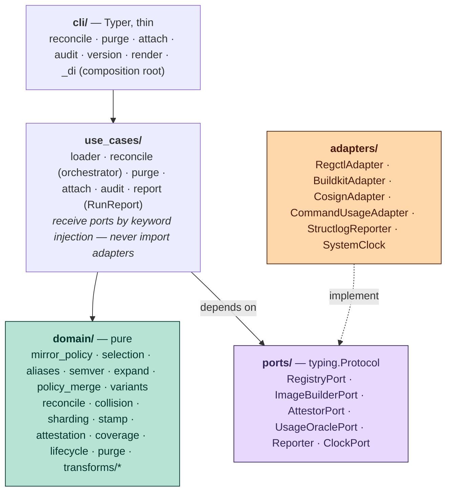
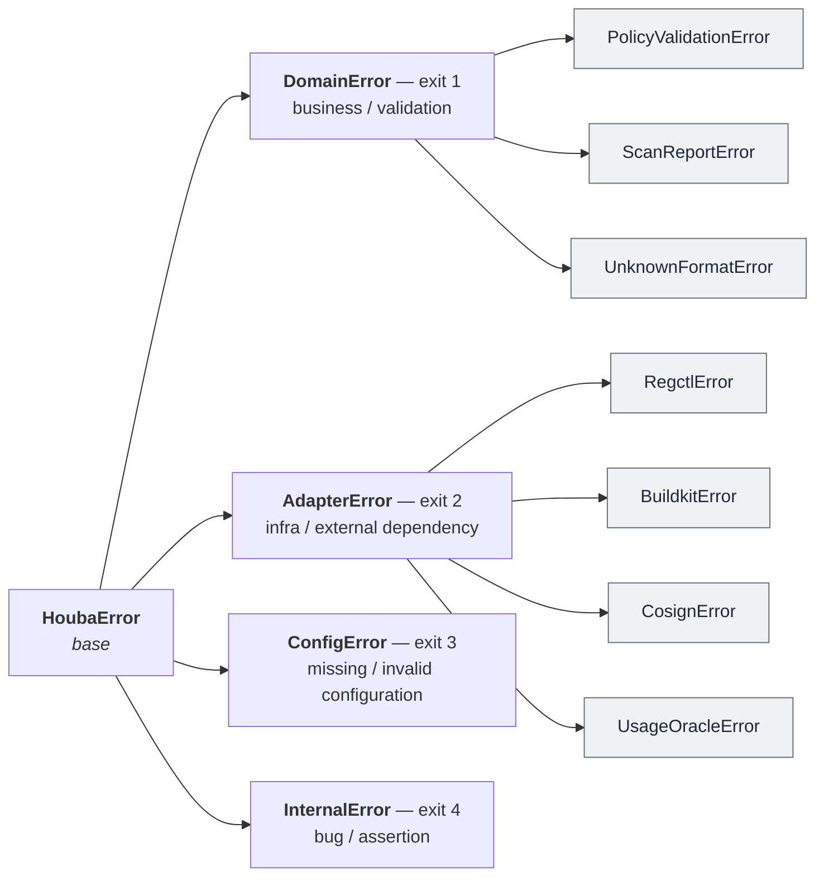

# houba — Design Overview

## What houba is (and isn't)

houba is a **stamper** and **single front door** for external container images — *not* an
image mirror. A mirror (`skopeo sync`, Harbor replication) makes a byte-for-byte copy. houba does
more: it routes every external image through one declarative policy, optionally **rebuilds** it
through a hardening transform (internal CAs, internal package mirrors), and **stamps** it with
standardized, portable provenance.

The value lands at incident time. When a critical CVE drops, a consistent provenance stamp turns
*"what's our blast radius, and who owns it?"* into a single query in the observability stack you
already run. Two consequences drive the design:

- **The label is the product.** houba's value flows through the stamp into someone else's query
  tool, so the provenance schema is the public API: standardized, portable, trustworthy.
- **Coverage gates value.** A stamp on part of the fleet yields a blast-radius query with blind
  spots. houba's worth is proportional to it being the *mandatory* path for external images.

See the [roadmap](../roadmap.md) for the product thesis in full.

## Two paths, one reconcile loop

Every imported tag takes one of two paths, chosen per policy by whether a `transform` is declared:

- **Copy path** (no transform) — `regctl copy` the source image into the destination, then
  **stamp** it with provenance annotations.
- **Rebuild path** (transform present) — render a Dockerfile (`FROM <source@digest>` + each
  transform step's fragment), build & push it through BuildKit, then **stamp** it.

In both paths the transformation is the means; the stamp is the deliverable.

## Architecture — hexagonal (ports & adapters)

houba is a hexagonal Python application. The layering is load-bearing: it is what keeps the
business logic pure and 100 % unit-testable with in-memory fakes, and the I/O
integration-testable in isolation.



The dependency inversion is the load-bearing part: **`use_cases/` and `adapters/` both point at
`ports/`** — the application orchestrates against the Protocol seams, the driven adapters implement
them, and nothing flows the other way (no layer ever imports `adapters/` except the `_di`
composition root).

### Golden rules

1. **`domain/` is pure.** No `httpx`, no `subprocess`, no `os.environ`, no clock, no file I/O.
   Pure functions on dataclasses / Pydantic models; "now" arrives as a `datetime` parameter.
   Coverage ≥ 90 %.
2. **`ports/` are `typing.Protocol` interfaces**, each with a frozen-dataclass data model
   alongside it. They never import adapters.
3. **`use_cases/` receive ports by injection** and orchestrate domain + ports. They never import
   adapters directly.
4. **`adapters/` hold all I/O.** Today every adapter shells out via `subprocess` (`regctl`,
   `buildctl`) or uses the stdlib (clock, structlog) — there is no HTTP client in the current set.
   Binaries are resolved lazily, on first call.
5. **`cli/` is thin** — parse args, build the composition root (`_di.py`), call the use case, map
   exceptions to exit codes.
6. **Only `config.py` reads `os.environ`** (Pydantic Settings, all `HOUBA_*`). Everything else
   takes config as an explicit parameter.

Adding a new external dependency always follows the same pattern: **port (Protocol + dataclass) →
fake (`tests/fakes/`) → adapter (`adapters/`) → wire into `cli/_di.py`**.

## The MirrorPolicy contract

A product declares its imports as a `MirrorPolicy` YAML document. This declarative schema is the
contract — prefer extending it over adding imperative branching. It is a Pydantic model published
as a **JSON Schema** (`mirror_policy_json_schema()`) so policy files get editor and CI validation.

Copy example (`docs/examples/busybox`):

```yaml
apiVersion: houba.io/v1alpha1
kind: MirrorPolicy
metadata:
  name: busybox
  labels:
    team: platform              # stable owner key → stamped as io.houba.owner.team
spec:
  artifactType: image
  source:
    registry: docker.io
    repository: library/busybox
  imports:
    - name: stable
      tags:
        includeRegex: "^1\\.3[67]\\."
        aliases:
          - "{major}.{minor}"     # 1.36 → highest 1.36.z
          - "latest"              # → highest overall
      destinations:
        - project: demo
          repository: busybox
```

Rebuild example with regional variants (`docs/examples/timezone`):

```yaml
spec:
  source: { registry: docker.io, repository: library/debian }
  imports:
    - name: slim
      tags: { semverOnly: false, includeRegex: "^bookworm-slim$" }
      variants:
        - { name: eu, suffix: "-eu", transform: [ { setTimezone: { zone: Europe/Paris } } ] }
        - { name: us, suffix: "-us", transform: [ { setTimezone: { zone: America/New_York } } ] }
      destinations:
        - { project: demo, repository: debian }
```

Schema shape (top level): `apiVersion`, `kind`, `metadata` (`name`, `labels`), `spec`. `spec`
carries `artifactType` (`image` | `helmChart` | `generic`), `source` (`registry`, `repository`),
optional `defaults`, and `imports[]` (≥ 1). Each import has `tags` (a `TagSelection`),
`destinations[]`, and optional `transform[]`, `archive`, `platforms[]`, `variants[]`. `defaults`
merge into each import — maps (`tags`, `archive`) shallow-merge on *explicitly-set* fields, lists
(`transform`, `destinations`, `platforms`) replace wholesale. `artifactType: generic` forbids
transforms.

**Transforms are named, portable references** — `injectCA: {certs: [corp]}`,
`rewritePackageSources: {mirror: internal}` — not org-specific scripts. The names (`corp`,
`internal`) resolve to org data (cert paths/PEM, mirror URLs) from `HOUBA_*` config at runtime,
which is what keeps this public repo generic.

## Reconcile — plan then apply

`reconcile_policies(...)` (in `use_cases/reconcile.py`) is the orchestrator. It is
**plan-then-apply**, **fail-fast on planning**, **idempotent**, **per-policy isolated**, and
**dry-runnable**.

1. **Plan (no mutation).** Per policy: list source tags → `resolve_imports` (merge defaults) →
   `expand_import` (regex/semver selection, alias + variant `suffix` expansion) →
   `validate_transform_steps` → resolve named CA/mirror refs and compute the `transform_version`
   content hash → resolve destinations → `detect_alias_collisions` across **all** policies. Any
   unknown ref, unreadable cert, or alias collision surfaces here, before any write.
2. **Apply (per-policy isolated — a failure marks that policy `partial`, others continue).**
   Configure registry TLS / login once per host. For each target: read source state (`inspect`)
   and the recorded mirror state (the `org.opencontainers.image.base.digest` +
   `io.houba.transform.version` annotations), then compute per-variant `to_import` / `to_update` /
   `aliases` and the target `to_delete`. Each output tag goes copy or rebuild; both paths then
   `annotate` with the provenance stamp. Aliases are `copy`; deletions are `delete_tag`.

**Change detection is provenance-based.** houba compares the **recorded** `base.digest` against
the current source digest — never mirror-vs-source (a rebuilt image's digest differs by
construction). Two axes:

- recorded `transform.version` ≠ desired ⇒ **update now** (the operator changed the hardening — no
  grace);
- else the source digest moved within the **7-day stability window** of its push time ⇒ **skip**
  (let a half-pushed tag settle); else **update**.

Moving-tag aliases are exempt from the grace window.

**Concurrency & scale-out.** Within a run, tag operations execute in parallel, bounded by
`HOUBA_MAX_CONCURRENCY` (or `--concurrency` / `-j`); set it to `1` for sequential runs. To scale
*across* processes, `domain/sharding.py` (`policy_shard` / `owns`) assigns each policy to a shard by
stable SHA-256 hash, so several pods — a Kubernetes Indexed Job — reconcile disjoint subsets of the
fleet without gaps or double-writes. Every reported operation records the transform steps it applied
and the digest it produced, alongside the source `base.digest` it was built from.

## Pluggable transform steps

The rebuild vocabulary lives in `domain/transforms/`, designed so **one new step = one
self-contained class + one registry entry**, with zero edits to the I/O layer:

- `base.py` — the pure contracts: `TransformStepCompiler` (an ABC with `name`, a Pydantic
  `params_model`, `resource_refs()`, `fragment()`), plus `Fragment`, `ResourceRef`,
  `ResolvedResource`, `ContextFile`.
- `steps.py` — the three built-ins: `injectCA`, `rewritePackageSources`, `setTimezone`.
- `registry.py` — `DEFAULT_REGISTRY`, an explicit tuple of built-ins plus name lookup.
- `render.py` — `validate_transform_steps`, `render` (assemble the Dockerfile + context files),
  and `transform_version` (the content hash that drives change detection). There is **no
  `if step.name == …`** anywhere — all dispatch goes through the registry.
- `schema.py` — derives the published JSON Schema for the step vocabulary (a discriminated
  `oneOf`) from the registry; never hand-written.

A step declares *what resources it needs* (`ResourceRef(kind, name)`); the application layer
resolves those refs to data. This seam keeps the step vocabulary pure (in `domain/`) and resource
resolution in the I/O layer.

## Provenance stamp — the label is the product

`domain/stamp.build_stamp_annotations(...)` builds the annotation dict baked onto every imported
or derived image. Standard facts use **OCI-standard keys** (any scanner reads them for free); only
the genuinely novel transformation lineage uses the `io.houba.*` namespace (prefix configurable
via `HOUBA_LABEL_PREFIX`, default `io.houba`; an empty prefix ⇒ no houba labels at all).

Always emitted (OCI standard):

- `org.opencontainers.image.source` — `{registry}/{repository}`
- `org.opencontainers.image.revision` — source digest (the immutable thing packaged)
- `org.opencontainers.image.base.name` — `{source}:{tag}`
- `org.opencontainers.image.base.digest` — source digest (the **idempotency key** reconcile reads
  back)
- `org.opencontainers.image.created`

With a non-empty prefix (houba identity + lineage):

- `{prefix}.artifact.type`, `{prefix}.policy`, `{prefix}.import`, `{prefix}.variant`
- `{prefix}.owner.team` (only when a team key is set)
- `{prefix}.transform.steps`, `{prefix}.transform.version` (only when a transform ran)

**Deliberately not stamped:** no registry / location fact (the same digest lives in many
registries — a runtime fact resolved downstream), and no human owner (resolved downstream by
joining the stable `team` key to a directory / CMDB). Immutable build facts on the artifact;
mutable org facts stay out. The three-level identity is `policy → import → variant`.

Heavy, signed provenance (**SLSA / in-toto attestations**) is **implemented** on the rebuild path
via `AttestorPort` → `CosignAdapter` (the pure builder is `domain/attestation.py`): cosign attaches
a signed DSSE attestation as an OCI referrer to the produced digest. It is **off by default**
(`HOUBA_ATTEST_SIGNER=""`) and supports `keyless` (Fulcio/Rekor), `kms`, and `key` signers — so a
registry with no signing config still gets the annotation stamp, and turning attestation on adds the
signed layer without changing the stamp. See the SLSA attestation spec under
`docs/superpowers/specs/`.

## Tag selection & expansion

The pure planning pipeline, all in `domain/`:

- `semver.py` — semver parsing / ordering of tags (non-semver sorted to a stable tail).
- `selection.py` — `(includeRegex − excludeRegex)`, drop non-semver if `semverOnly`, then union
  explicit `names` that exist upstream (names bypass the filters).
- `aliases.py` — resolve moving-tag aliases from templates (`{major}` / `{minor}` / `{patch}`,
  named captures, literal `latest`), each pointing at the highest matching tag.
- `policy_merge.py` — merge `defaults` into each import → `ResolvedImport`.
- `variants.py` — expand variants into `(name, suffix, transform)` triples (an implicit `default`
  if none are declared).
- `expand.py` — combine selection + aliases + variants into an `ExpandedImport` (the suffix is
  carried here, applied later by reconcile).
- `reconcile.py` — compute the `to_import` / `to_update` / `to_delete` plan (pure; source state,
  mirror state, and `now` are all inputs).
- `collision.py` — fail fast if two policies write the same alias to the same destination repo.
- `sharding.py` — stable SHA-256 assignment of policies to shards (`policy_shard` / `owns`) for
  horizontal scale-out across pods.

## Error model & exit codes

`houba/errors.py` defines the `HoubaError` hierarchy; `exit_code_for(exc)` walks the exception's
MRO and returns the first matching branch's code:



Anything not under `HoubaError` (e.g. a stray `KeyError`) ⇒ exit 4. Pydantic `ValidationError` /
settings errors ⇒ exit 3 (config). When `reconcile` accumulates per-policy failures, the process
exit code is the **worst** (max) of the failed policies' codes (`report_exit_code`). There is no
retry logic anywhere — the current adapters shell out and surface failures immediately.

## Configuration

`config.py` is the only place `os.environ` is read (Pydantic Settings, prefix `HOUBA_`). Key vars:

- `HOUBA_LABEL_PREFIX` (default `io.houba`)
- `HOUBA_REGISTRIES` — a JSON roster mapping a logical name → registry (`host`, optional
  `username` / `password`, `tls_verify`, `ca_cert`)
- `HOUBA_TRANSFORM_CA_CERTS`, `HOUBA_TRANSFORM_PACKAGE_MIRRORS` — JSON rosters the transform refs
  resolve against
- `HOUBA_BUILD_PLATFORM` (default `linux/amd64`), `HOUBA_WORK_DIR`
- `HOUBA_LOG_FORMAT` / `HOUBA_LOG_LEVEL`, `HOUBA_DRY_RUN_TAGS` / `HOUBA_DRY_RUN_DELETIONS`
- `HOUBA_ATTEST_*` — SLSA/in-toto signing (off by default): `HOUBA_ATTEST_SIGNER`
  (`""` | `keyless` | `kms` | `key`), `HOUBA_ATTEST_KEY_REF` (required for `kms`/`key`),
  `HOUBA_ATTEST_FULCIO_URL` / `HOUBA_ATTEST_REKOR_URL` / `HOUBA_ATTEST_BUILDER_ID`
- `HOUBA_PURGE_MIN_IDLE_DAYS` — the idle window `houba purge` requires before reaping a marked tag

Nested registry / cert / mirror configs are JSON sub-objects inside their env var (not separate
env prefixes). Resolver helpers (`resolve_registry`, `resolve_ca_certs`, `resolve_mirror`) raise
`ConfigError` (exit 3) on unknown names; a destination's `registry` may be omitted only when
exactly one registry is configured.

**Registry trust vs image hardening are separate concerns:** `RegistryConfig.ca_cert` (TLS trust
for *talking to* a registry, path-only) is deliberately distinct from `transform_ca_certs` (CAs
*baked into* rebuilt images).

## CLI

Five commands (`houba …`):

- **`reconcile <directory> [--dry-run] [--verbose]`** — load every `*.yml` / `*.yaml` policy in
  the directory, reconcile them, render a report to **stdout** (text or JSON) while a structured
  event journal goes to **stderr**, and exit with `report_exit_code`.
- **`purge [--registry NAME] [--apply]`** — the reference reaper: walk `pending-deletion` marks and
  delete tags not seen in production within `HOUBA_PURGE_MIN_IDLE_DAYS` (resolved against a usage
  oracle). Dry-run by default; `--apply` actually deletes (still gated by `HOUBA_DRY_RUN_DELETIONS`).
- **`attach <image-ref> --report <file|-> [--format F] [--output text|json]`** — ingest a scan
  report produced upstream and attach it as a stamped OCI referrer on the image.
- **`audit [--registry NAME] [--fail-on-uncovered]`** — coverage-gap report: walk the registry and
  list images that do **not** carry houba's stamp; `--fail-on-uncovered` makes it a CI gate.
- **`version`** — print the installed version.

(`cli/render.py` is the shared report formatter, not a separate command.)

## Status

- **Delivered** — the full hexagon (`domain/`, `ports/`, `adapters/`, `use_cases/`, `cli/`); both
  the copy and the **rebuild / derive-and-stamp** paths; the pluggable transform engine with three
  built-in steps; the OCI-standard + `io.houba.*` provenance stamp **plus signed SLSA / in-toto
  attestations** (cosign, off by default); provenance-based, transform-aware change detection; the
  `reconcile` / `purge` / `attach` / `audit` commands (delegated deletion + the reference reaper, scan
  ingestion, and the coverage-gap audit); concurrent + horizontally-shardable reconcile; a `regctl`
  + `buildctl` + `cosign` runtime image; and a kind-based [reference deployment](README.md) that
  doubles as the production blueprint.
- **Deferred** — deb822 (`*.sources`) package sources in `rewritePackageSources`; multi-platform
  rebuild (the copy path is multi-arch, the rebuild path is single-platform); the remaining roadmap
  verbs (`archive_restore`, `product_init` / `product_delete`).
- **Out of scope** — runtime presence / fleet inventory (the org's observability stack assembles
  the blast-radius query by reading the stamp); end-of-life awareness (carried by the sibling tool
  `regis`).

See the [README](../../README.md) for install and configuration, the [roadmap](../roadmap.md) for
direction, and the [C4 model](README.md).
