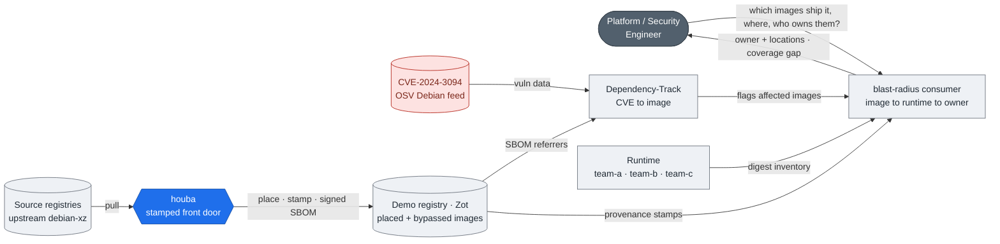
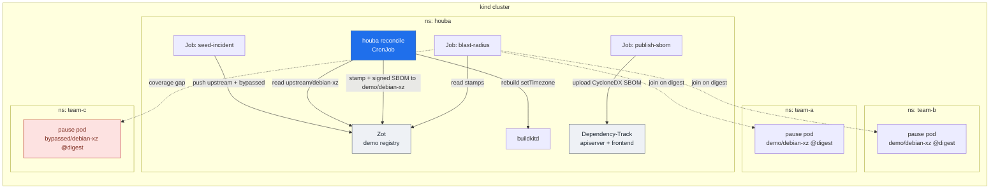

# Blast-radius demo — CVE-2024-3094 (XZ backdoor)

**Audience:** platform engineers, security engineers, engineering managers (~12 min)

This walkthrough shows a single end-to-end loop: from a disclosed CVE to
*which images ship it*, *where they run*, and *who owns them* — joined on
the image digest. The three legs are: houba (the stamped front door that
attaches a signed package-level SBOM as an OCI referrer to every placed
image), Dependency-Track (the CVE-to-image leg, fed by those SBOMs), and a
blast-radius consumer script (the image-to-runtime-to-owner join). houba is
one leg; the other two are commodity. The fixture is `xz-utils 5.6.1-1` and
`CVE-2024-3094`. A second image, `bypassed/debian-xz`, was pushed directly
into the registry — never through houba. The demo makes both the coverage
and its blind spot visible at the same time.

The three legs, joined on the image digest:



houba is one leg; Dependency-Track and the blast-radius consumer are commodity.
The deployment that runs this is in [step 1](#1-bring-the-stack-up).

---

## 1. Bring the stack up

```bash
make local
```

`make local` builds the houba runtime image, creates a kind cluster, and
brings up four components inside the `houba` namespace:

- **houba** — the reconcile CronJob (fires immediately via `local-run`)
- **Zot** — the throwaway OCI registry (`registry.houba.svc.cluster.local:5000`)
- **buildkitd** — the in-cluster build daemon houba drives for the rebuild path
- **Dependency-Track** (apiserver + frontend) — the SCA platform that receives the SBOMs

`make local` is the inner-loop shortcut (`kubectl apply -k`, no operators). The
Argo App-of-Apps equivalent — with ExternalSecretOperator, OpenBao, and
ArgoCD — is `make demo`.

The deployed topology — and the incident loop running through it:



The `bypassed/debian-xz` path (red) never touches houba — no stamp, no SBOM — so
it surfaces only as the coverage gap in step 7.

> **RAM:** Dependency-Track requires a 4 GB heap. Give your kind/Docker VM
> at least 8 GB or the apiserver pod stays `Pending`.

---

## 2. Parity beat

houba replaces the legacy CI + registry-replication intake. One important
difference: registry replication strips OCI 1.1 referrers (Harbor ≤ 2.15.x
silently drops them on replication). The SBOM and cosign signature that make
this demo work would not survive a replication hop; they survive here because
every image comes through houba's front door.

See [Migrate from replication](../../../how-to/migrate-from-replication.md)
for the cut-over how-to.

---

## 3. Seed the incident

`make local` already calls `seed-incident` internally, but you can re-run it
independently at any time:

```bash
make seed-incident
```

This builds a Dockerfile fixture in-cluster (via buildkitd) that installs
`xz-utils 5.6.1-1` from a Debian sid snapshot. The job pushes two repos into
the demo Zot:

- `upstream/debian-xz:5.6.1` — the pretend-upstream source (what houba reads)
- `bypassed/debian-xz:5.6.1` — the same image pushed directly, bypassing houba

---

## 4. Place through the front door

```bash
make local-run
```

`local-run` fires a one-shot reconcile from the suspended CronJob. houba reads
`xz.yml` (the `MirrorPolicy` in this directory), matches tag `5.6.1`, and for
each placed image:

1. Rebuilds it through the `setTimezone` transform (the front-door hardens)
2. Stamps it with OCI-standard + `io.houba.*` provenance annotations
   (`owners: group:default/platform`, policy identity, transform lineage)
3. Attaches a **signed CycloneDX SBOM** as an OCI referrer (via syft + cosign)
4. Pushes the result to `demo/debian-xz:5.6.1` in the demo Zot

`bypassed/debian-xz` has none of those — no stamp, no SBOM, no signature.

---

## 5. Run the marked workloads

```bash
make incident-deploy
```

`incident-deploy` resolves the live digests of `demo/debian-xz:5.6.1` and
`bypassed/debian-xz:5.6.1` from the in-cluster Zot, then applies pause pods
pinned to those exact digests across three namespaces:

- `team-a` — `debian-xz` (placed digest)
- `team-b` — `debian-xz` (placed digest)
- `team-c` — `debian-xz-bypassed` (bypass digest)

These are the runtime stand-ins. The digest join is real; see
[Honesty / stand-ins](#9-honesty--stand-ins) for what this simplifies.

---

## 6. Light up the CVE

```bash
make dt-bootstrap && make dt-vulns
```

`dt-bootstrap` mints a Dependency-Track API key and enables the **keyless OSV
Debian** vulnerability ecosystem. `dt-vulns` restarts the DT apiserver to
trigger the OSV mirror (DT only mirrors on restart; the data PVC keeps the
mirror across restarts). The mirror takes a few minutes to complete.

Once the mirror is done, re-upload the SBOMs so DT re-analyzes them:

```bash
make publish-sbom
```

Then open the UI:

```bash
make dt-ui
```

Browse to the `demo/debian-xz` project. DT flags **DEBIAN-CVE-2024-3094** on
`xz-utils 5.6.1-1`. `bypassed/debian-xz` has no project — it was never
uploaded, because it has no SBOM referrer.

---

## 7. The join

```bash
make blast-radius
```

The blast-radius consumer script reads the houba stamp from each digest in the
registry, then joins against the runtime inventory (the namespace/pod list
from step 5). The report has three sections:

**Inventory** — one row per placed image, with owner and runtime location:

```
IMAGE                       TAG    OWNERS                    RUNNING IN
demo/debian-xz              5.6.1  group:default/platform    team-a, team-b
```

**Rollups** — aggregated by cluster-namespace and by owner:

```
BY NAMESPACE   team-a: 1 image   team-b: 1 image
BY OWNER       group:default/platform: 1 image (2 running instances)
```

**Coverage gap** — images with no stamp in the registry:

```
⚠  bypassed/debian-xz:5.6.1  carries NO houba stamp — no owner, no SBOM
   RUNNING IN: team-c
```

That last line is the blind spot made explicit: the image that bypassed the
front door shows up in the runtime inventory but cannot be attributed. On
disclosure day that is the ungovernable exposure.

---

## 8. Guardrail

houba **never detects or blocks the backdoor.** Nothing did, pre-disclosure.
houba rebuilds faithfully from its mirror; the value is that on disclosure day
*"which images ship xz 5.6.0–5.6.1?"* is one query with an answer — including
third-party images — because they came through the front door with a signed
package inventory. Any claim that houba detects or prevents the backdoor is
wrong.

---

## 9. Honesty / stand-ins

**(a) Namespaces as clusters.** `team-a`, `team-b`, `team-c` are Kubernetes
namespaces in a single kind cluster, standing in for separate production
clusters. The blast-radius report labels them as namespaces; a production
integration would substitute real cluster names from the runtime inventory
source (e.g. a CMDB, a fleet agent, or a CI label).

**(b) Pause pods, not the real image.** The workloads in step 5 are pause pods
annotated with the placed/bypass digests — not a live pull of the image from
the in-cluster Zot. The in-cluster registry is not node-pullable in this demo
setup. The digest join is real: the annotation carries the exact digest houba
pushed, and the blast-radius script joins on that. In production the same
join runs against a real runtime inventory (node image lists, admission
webhook records, or a runtime scanner feed) using the same digest.

**(c) `group:default/platform` is a Backstage entity-ref.** Resolving it to a
named person or a PagerDuty escalation policy is the developer coverage portal
(roadmap Later). This demo shows the entity-ref is present and queryable on
disclosure day; turning it into a notification is the next layer up.

---

## Tear down

```bash
make down
```

Deletes the kind cluster and all resources.
