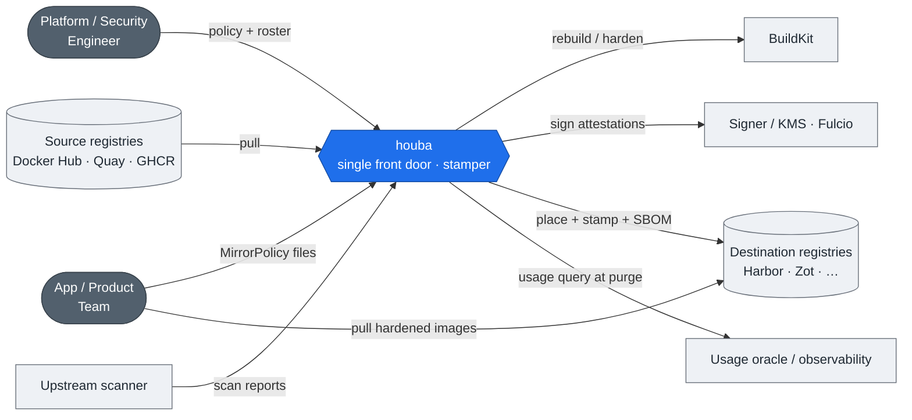
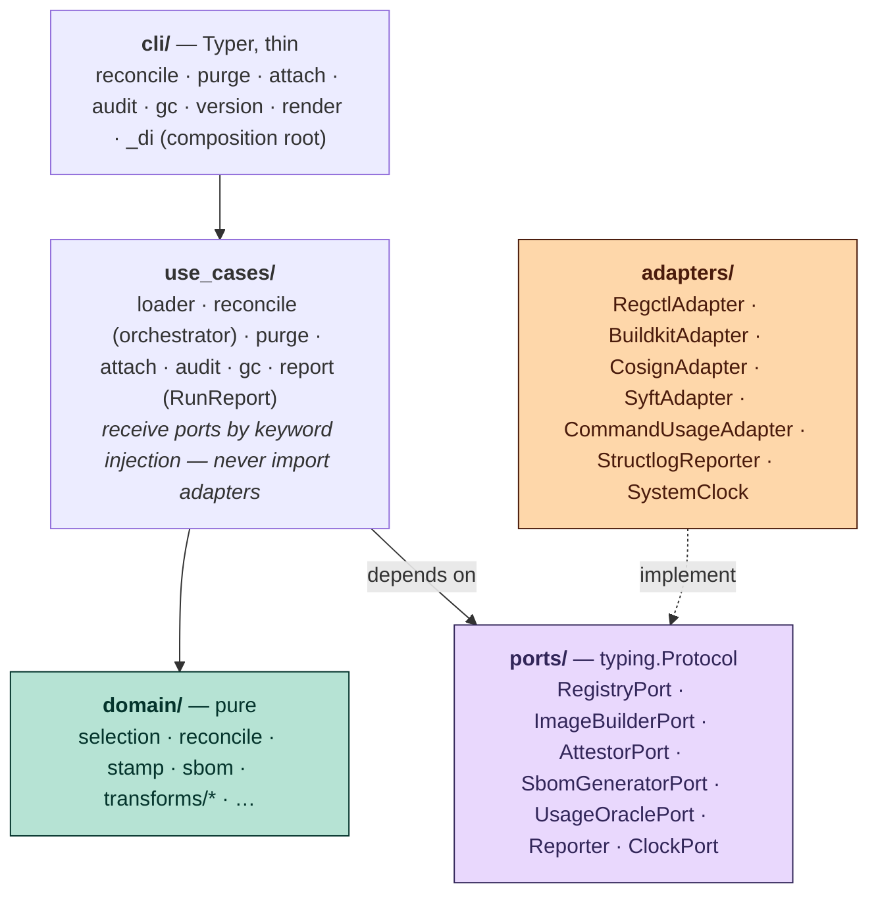
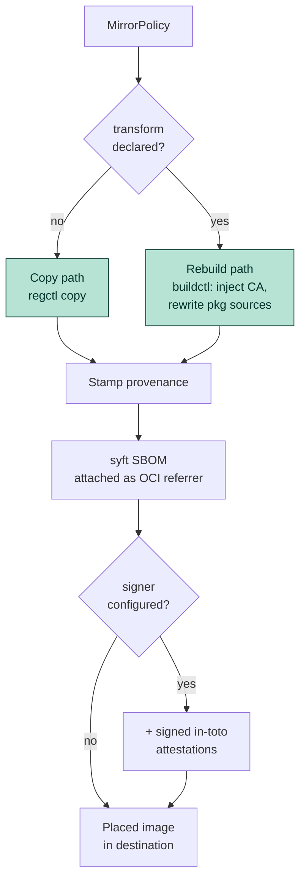
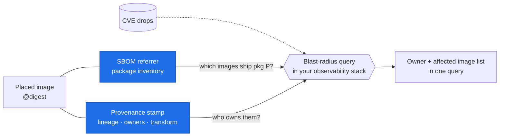

houba is the single front door for external images: it places them (copy or rebuild-and-harden), stamps portable provenance, and attaches a package-level SBOM. This page tells the story of how it's built; for the full rationale and the C4 model, see the deep-dive links at the foot.

## The landscape

A platform or security engineer owns the policy and registry roster; app teams declare `MirrorPolicy` files and pull hardened images from the destination registry. houba talks to source registries (Docker Hub, Quay, GHCR…), a BuildKit daemon for rebuilds, a signer or KMS for attestations, an upstream scanner that hands houba its scan reports, and a usage oracle that `purge` consults before deleting anything.



## The hexagon

The layering is load-bearing: pure `domain/` holds all business logic with no I/O; `use_cases/` orchestrates it; `ports/` (typing Protocols) define the I/O contracts; `adapters/` (subprocess wrappers) implement those contracts; and a thin `cli/` layer parses arguments and wires everything together via `_di.py`. Dependency inversion means `use_cases/` and `adapters/` both point at `ports/`; nothing imports `adapters/` except the composition root — which is how you can test every use case with in-memory fakes.



## The two placement paths

houba selects the path from the policy itself: with no `transform` declared, the image is copied byte-for-byte via `regctl` and stamped; when a `transform` is present, houba rebuilds it through BuildKit (inject CA, rewrite package sources) and stamps the result. Both paths receive a syft SBOM attached as an OCI referrer; both can be signed with cosign.

A `MirrorPolicy` is the single declarative artifact: it names an upstream `source`, the tags to admit, and where to place them. The optional `transform` is the switch that flips an import from copy to rebuild:

```yaml
apiVersion: houba.io/v1alpha1
kind: MirrorPolicy
metadata:
  name: redis
spec:
  artifactType: image
  source:
    registry: docker.io
    repository: library/redis          # the external image to admit
  imports:
    - name: v7
      owners:
        - group:default/data-platform  # stamped as io.houba.owners
      tags:
        includeRegex: "^7\.2\."         # which upstream tags to admit
      # transform:                       # ← omit → copy path; declare → rebuild path
      #   - injectCA: { certs: [corp] }
      #   - rewritePackageSources: { mirror: corp }
      destinations:
        - project: mirror
          repository: redis
```

For the full schema see the [MirrorPolicy reference](../reference/schemas/mirror-policy.md); for runnable examples, the [example policy catalog](/examples).



To walk the rebuild path step by step, see [Rebuild & harden an image](../how-to/rebuild-and-harden.md).

## Why the label is the product

The value lands at incident time, not placement time. The provenance stamp carries lineage and owners; the SBOM carries the package inventory; both ride the image digest as OCI referrers so they travel with every copy. When a CVE drops, "which images ship package P, and who owns them?" becomes one query in the org's own observability stack. houba produces the facts — it never runs the query itself.



## Go deeper

- [Architecture & design](https://github.com/trivoallan/houba/blob/main/docs/architecture/design.md) — full rationale, design decisions, and trade-offs
- [The full C4 model (Structurizr views)](https://github.com/trivoallan/houba/tree/main/docs/architecture) — System Landscape, Context, Container, Hexagon, Component, and Deployment views
- [Decision records](https://github.com/trivoallan/houba/tree/main/docs/architecture/decisions) — ADRs linked to specs

For in-depth coverage of specific subsystems, see [transforms and signed attestations](attestations.md), [SBOM generation and attachment](sbom.md), and [deletion and retention policy](deletion-and-retention.md).
