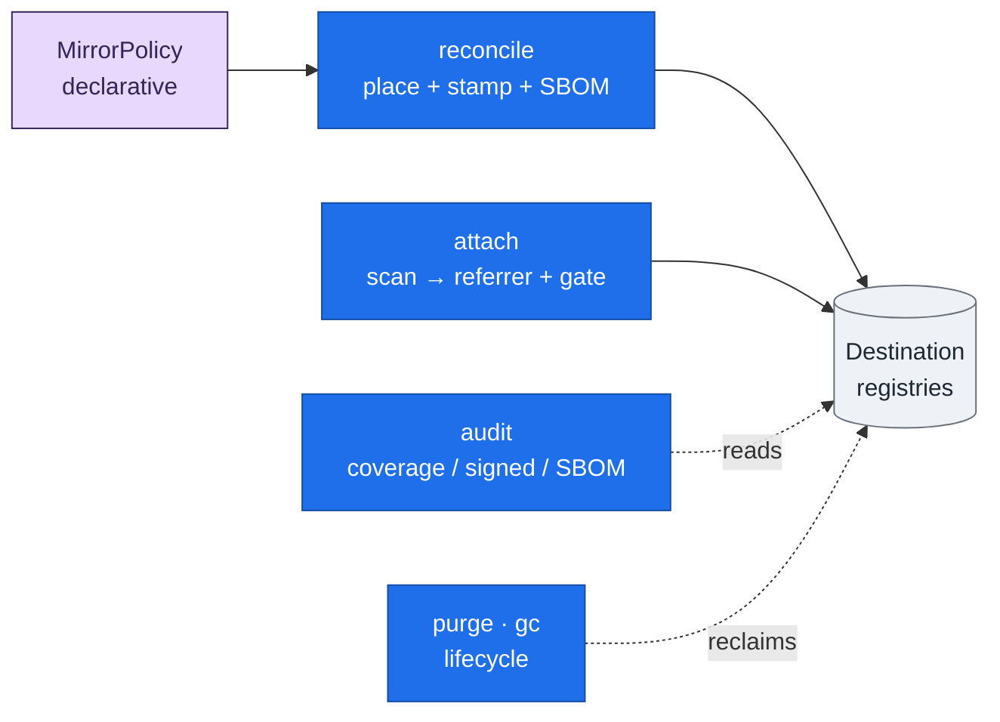

houba is the single front door for external container images: every image that enters the
organisation passes through it, comes out **placed**, **stamped**, and carrying a
**package-level SBOM**, and — when a signer is configured — **signed**. This page is a map of
the features that make that loop work, each linked to the how-to that drives it and the
reference that specifies it. For *why* the loop is shaped this way, see
[Architecture at a glance](architecture.md); this page is the *what*.

Everything is driven from one declarative artifact (a [`MirrorPolicy`](../reference/schemas/mirror-policy.md))
and a handful of CLI verbs: `reconcile · attach · audit · purge · gc`.

## Placement — copy or rebuild-and-harden

`houba reconcile` reads a policy and brings the admitted upstream tags into your destination
registries. houba picks the path from the policy itself:

- **Copy** — with no `transform` declared, the image is copied byte-for-byte (via `regctl`)
  and stamped. Fast, faithful, no rebuild.
- **Rebuild-and-harden** — when a `transform` is present, houba rebuilds the image through
  BuildKit, applying declarative hardening steps, and stamps the result.

Either way, placement is **idempotent** and supports a **dry run** (`--dry-run`) that reports
what would change without touching the registry. A policy's `destinations` list fans one
upstream image into many team registries in a single pass — which is how houba
[replaces registry replication](../how-to/migrate-from-replication.md) while keeping referrers
alive. Walk it end to end in [Rebuild & harden an image](../how-to/rebuild-and-harden.md).

### Composable hardening transforms

The rebuild path is built from declarative, pluggable primitives rather than bespoke pipeline
scripts — so any organisation's hardening becomes *configuration*:

- **`injectCA`** — trust internal certificate authorities.
- **`rewritePackageSources`** — point package managers at internal mirrors (deb822-aware).
- **`setTimezone`** — pin the image timezone.

Transform steps and their version are recorded in the stamp as lineage, so a placed image
declares exactly how it was hardened.

## Provenance stamp — the portable label

Every placed image (copy **and** rebuild) is stamped with standardized, portable provenance.
houba uses **OCI-standard annotation keys** for the universal facts —
`org.opencontainers.image.source` / `.revision` / `.base.name` / `.base.digest` / `.created` —
so any scanner reads them for free, and `io.houba.*` keys only for the novel facts: the
artifact type, the three-level `policy` / `import` / `variant` identity, the `owners`
(Backstage entity-refs), and the transform lineage. No location is ever stamped — the same
digest can live in many registries. The prefix is configurable (`HOUBA_LABEL_PREFIX`); an empty
prefix emits only the OCI-standard keys. The full contract is the
[provenance-stamp reference](../reference/schemas/mirror-policy.md), and the rationale is in
[transforms & signed attestations](attestations.md).

## Package-level SBOM — the inventory on every image

On **every image it places**, houba generates a package-level SBOM with standalone
[`syft`](https://github.com/anchore/syft) and attaches it to the placed digest as an **OCI
referrer**. This is what turns *"which images ship the vulnerable package?"* into a query that
answers retroactively, the instant a new CVE drops — independent of any scan's run date.
Generation is **always-on**; `HOUBA_SBOM_FORMATS` chooses the format(s) — **SPDX**, **CycloneDX**,
or both — never *whether*. Coverage is self-healing: a kept digest missing its SBOM is
re-covered on the next reconcile without a rebuild. Details and the bounded bare-binary limit are
in [package-level SBOM](sbom.md); to read one back, see
[Inspect an image's SBOM](../how-to/inspect-sbom.md).

## Signed attestations — presence, then trust

With a signer configured (`HOUBA_ATTEST_SIGNER` — keyless/Fulcio, KMS, or key), houba
**additionally** signs its facts as in-toto / SLSA attestations under its own identity, using
`cosign`: the transform provenance, the ingested scan, and the SBOM each become a signed
attestation with the canonical predicate type. A downstream admission controller can then
*require* trustworthy provenance with stock `cosign verify-attestation`. Presence is
unconditional; trust rides the signer. See [transforms & signed attestations](attestations.md).

## Enforcement — the front door can say *no*

Two features turn houba from observation into a gate:

- **`houba attach`** ingests an upstream scanner's report (SARIF today) and attaches it to the
  image as a **signed OCI referrer** — provenance that *this digest came through the front door*.
  With **`--fail-on <severity>`** it doubles as a **CI gate**: it exits non-zero when the scan has
  any finding at or above the threshold (`critical > high > medium > low > unknown`),
  observational by default. See [Attach a scan report](../how-to/attach-scan.md) and
  [the verify gate](../how-to/verify-gate.md).
- **`houba audit`** is the coverage gate: it walks the registries and reports which images do
  **not** carry the stamp — the verifiable front door. Three tiers stack on one read:
  coverage (`--fail-on-uncovered`), **signed** vs merely stamped (`--signed` /
  `--fail-on-unsigned`), and **SBOM presence** (`--sbom`). It is read-only and report-only by
  default. See [Audit coverage](../how-to/audit-coverage.md).

The coverage ladder these features build is `uncovered < stamped < signed < has-SBOM`.

## Lifecycle — reclaim safely

- **`houba purge`** removes tags that retention no longer keeps, **usage-gated**: it consults a
  prod-usage oracle (`HOUBA_USAGE_ORACLE_CMD`) before deleting, marks via reversible soft-delete
  rather than hard-deleting, and honours a 7-day digest-stability grace window. See
  [Purge unused tags](../how-to/purge-unused-tags.md) and
  [deletion & retention](deletion-and-retention.md).
- **`houba gc`** collects superseded scan-result referrers, keeping the N newest per
  `(tool, format)` older than a grace window. Dry-run by default, `--apply` to delete. See
  [Garbage-collect scan referrers](../how-to/gc-scan-referrers.md).

## Declarative configuration — policy and environment

houba is configured two ways, both declarative and both schema-backed:

- **Policy** — the [`MirrorPolicy`](../reference/schemas/mirror-policy.md) is the single
  user-facing artifact: the upstream `source`, tag [selection](../reference/schemas/mirror-policy.md)
  (include/exclude regex, semver-only), `transform` hardening, `owners`, and `destinations`.
  The schema is published so policy files get editor and CI validation.
- **Environment** — all operator settings are `HOUBA_*` variables, documented in the
  [configuration reference](../reference/configuration.md): the registry roster
  (`HOUBA_REGISTRIES`), CA certs and package mirrors for transforms, the label prefix, the SBOM
  formats, the signer, and the build platform.

## Where to go next

- [Getting started](../tutorials/getting-started.md) — install and run the loop end to end.
- [How-to guides](/how-to) — task-focused walkthroughs for each feature above.
- [Reference](/reference) — the generated policy schema, `HOUBA_*` config, CLI, and glossary.
- [Architecture at a glance](architecture.md) — how the features are assembled behind the hexagon.
