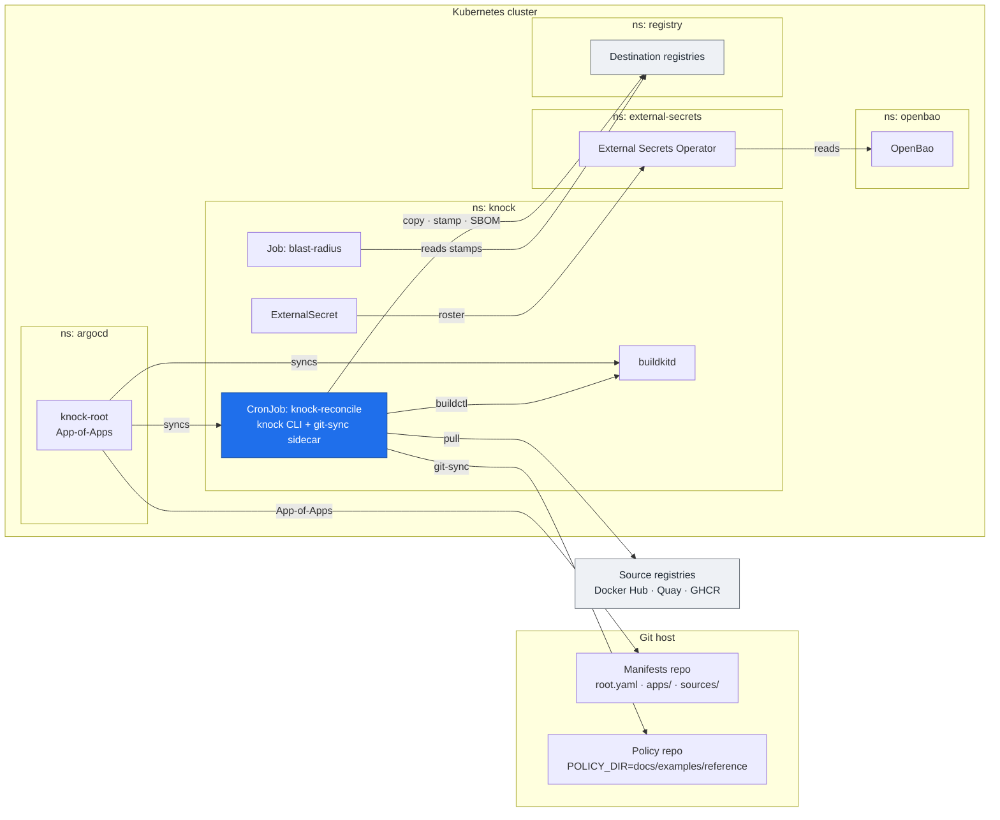

The blessed way to run knock: a Kubernetes **CronJob** that `knock reconcile`s a
git-sync'd policy repo. There are **two** entry points, and they share the same `deploy/base`:

- **`deploy/argocd/`** — the single **reference**. An Argo **App-of-Apps** that is *both* the
  production blueprint *and* the kind demo (no demo/prod split). Run it on kind with `make demo`.
- **`deploy/overlays/local`** — the **inner-loop escape hatch**: a plain `kubectl apply -k`
  overlay (no Argo, no operators) that renders your **local, uncommitted** manifests. Run it with
  `make local`.

If your team already runs a skopeo → Harbor intake and wants to drop knock in without a Kubernetes migration first, see [Drop knock into an existing Jenkins/skopeo/Harbor intake](./brownfield-drop-in.md) — `make demo-mongobleed` is the headline path for that case. The Argo App-of-Apps described here is the greenfield "Reference B" for GitOps-native platforms.

The Argo reference reads its children **from git**, so it reflects what is *pushed*; `make local`
is what you reach for to iterate on a local branch. Design rationale:
[the spec](https://github.com/trivoallan/knock/blob/main/docs/superpowers/specs/2026-06-11-reference-deployment-design.md) and the C4
[Deployment view](https://github.com/trivoallan/knock/blob/main/docs/architecture/workspace.dsl).

Rendered, the reference stack `make demo` brings up on kind (the production blueprint, minus the optional add-ons) looks like this:



```
deploy/
  base/                       CronJob(knock) + git-sync + blast-radius Job + config
  components/buildkitd/       rebuild-path add-on (rootless buildkitd + NetworkPolicy)
  components/keda-buildkitd/  OPTIONAL buildkitd autoscaling (KEDA + Prometheus)
  argocd/                     App-of-Apps reference: ESO + OpenBao (wave 0),     ← make demo
                              knock + buildkitd (wave 1); Zot out-of-band
  overlays/local/             kind: base + buildkitd + Zot, no operators         ← make local
```

## Prerequisites

- `docker`, `kind`, `kubectl` on PATH.
- The knock image must bundle `regctl` + `buildctl` (the runtime `Dockerfile` does).

## The reference — `make demo` (Argo App-of-Apps)

```sh
make demo             # kind up → install argo-cd → apply root → sync from git → seed OpenBao
                      #   → Zot out-of-band → reconcile → report
make demo-run         # another one-shot reconcile from the synced CronJob
make scan             # grype on the SBOM -> knock attach (front-door scan provenance)
make blast-radius     # re-read the stamp and print blast radius (now with a SCAN column)
make registry-ui      # port-forward Zot's built-in UI to http://localhost:8082
make argocd-ui        # ArgoCD UI (admin creds printed) at https://localhost:8083
make logs             # tail the reconcile logs
make down             # tear down the cluster
```

`make demo` brings up the **whole reference stack on kind and reconciles the reference policy
end-to-end**:

1. applies the App-of-Apps root (`deploy/argocd/root.yaml`); ArgoCD then pulls the four child
   Applications from git and syncs them — **ESO + OpenBao** in sync wave 0, then **knock +
   buildkitd** in wave 1;
2. seeds the dev OpenBao so ESO materializes the `knock-registries` Secret;
3. deploys a throwaway **[Zot](https://zotregistry.dev)** **out-of-band** (the push destination the
   Argo apps set omits — it matches the seeded roster host `registry.knock.svc.cluster.local:5000`);
4. waits for the secret + CronJob, fires a one-shot reconcile, and runs blast-radius.

Zot ships a **built-in web UI** (the `search` + `ui` extensions), so after a reconcile
`make registry-ui` port-forwards it to <http://localhost:8082>, where you can browse the mirrored
repos/tags and read the provenance annotations on each manifest — the stamp, made visible. The UI is
served by the registry itself (no second component, no CORS plumbing); it is demo-only — a real
cluster browses its own Harbor/Zot console. The reconcile/blast-radius Jobs log in **human-readable
text** (`KNOCK_LOG_FORMAT=text`) so `make logs` reads cleanly; point `KNOCK_LOG_FORMAT=json` where a
log pipeline ingests the structured events instead.

The policy front door defaults to the bundled **reference example**
(`docs/examples/reference`, git-sync'd from this repo), which carries **both** a copy entry
(busybox → `demo/busybox`) **and** a rebuild entry (debian-tz → `demo/debian`), so one reconcile
exercises the copy path *and* the rebuild/stamp path. The image defaults to the locally-built
`knock:dev`, so it runs the current code against a real policy with no edits.

`make` applies **only** `root.yaml`; ArgoCD pulls the children from git and syncs them. It also
installs argo-cd and patches `argocd-cm` with
`kustomize.buildOptions: --load-restrictor LoadRestrictionsNone` (a global build option, required
because `base` references `scripts/blast-radius.sh` outside `deploy/`; ArgoCD has no per-Application
equivalent).

Expect the blast-radius report to list the mirrored `demo/busybox` + `demo/debian` artifacts grouped
by `base.digest` and by `owners`, and to flag any artifact carrying no stamp as a
**coverage gap** (run `make blast-radius` *before* the first reconcile to see the gap, then again
after to see it close — coverage gates the value).

:::note Branch ceiling
ArgoCD reads the child Applications **from git**, so the demo reflects what is *pushed*, not local edits. To demo your branch, push it to your fork and run `ARGOCD_REPO_URL=https://github.com/you/knock ARGOCD_REPO_REF=your-branch make demo`. To iterate on **uncommitted** changes, use `make local` instead.
:::

## The inner-loop escape hatch — `make local` (`kubectl apply -k`)

```sh
make local            # kind up → build+load knock:dev → apply overlays/local → reconcile → report
make local-run        # another one-shot reconcile (idempotent — unchanged tags are skipped)
```

`make local` renders **`deploy/overlays/local`** — `base` + the buildkitd component + a
plain-secret registry roster + a throwaway Zot, with the CronJob suspended and fired on
demand. It uses **no operators** (no ESO, no OpenBao) and renders your **local, uncommitted**
manifests, so it is the fast path for iterating on a branch. It reconciles the same reference
policy (copy + rebuild) as `make demo`.

:::note
`make local` renders with `kubectl kustomize --load-restrictor LoadRestrictionsNone` (then `apply -f -`) because the blast-radius `configMapGenerator` references the canonical `scripts/blast-radius.sh`, kept outside `deploy/` so it is also runnable standalone against the examples. `kubectl apply -k` cannot pass the flag, so render-then-apply.
:::

## Adopting it in real prod

`deploy/argocd/` is the blueprint as well as the demo. To adopt:

1. Copy `root.yaml`, hardcode your `repoURL` / `targetRevision`, `kubectl apply` it. ArgoCD brings
   up ESO + OpenBao, then knock + buildkitd.
2. Point `sources/knock` at **your** policy repo (the `POLICY_REPO_URL` config) and your pinned,
   published image (`knock:dev` → your tag). A merged PR in that repo is the front door; git-sync
   brings it into the pod each run.
3. **Secrets:** the reference bootstraps OpenBao in **dev mode** (kind-demoable only). The two
   demo-only glue steps below wire ESO to it (never committed — credential *values* stay out of
   git); `make openbao-seed` runs exactly these:
   ```sh
   # (a) the token ESO authenticates with — dev root token is "root"
   kubectl -n openbao create secret generic openbao-token --from-literal=token=root
   # (b) seed the registry roster ESO will materialize (placeholder for the demo).
   #     Select the OpenBao server pod by name (the chart's server is a StatefulSet, openbao-0).
   kubectl -n openbao exec -i \
     "$(kubectl -n openbao get pod -o name | grep -E 'openbao-[0-9]+$' | head -1)" -- \
     sh -c 'BAO_ADDR=http://127.0.0.1:8200 BAO_TOKEN=root bao kv put secret/knock/registries KNOCK_REGISTRIES='"'"'{"local":{"host":"registry.knock.svc.cluster.local:5000","tls_verify":false}}'"'"''
   ```
   For real prod, harden OpenBao (seal/unseal + Kubernetes auth, dropping the static token) or
   repoint the `ClusterSecretStore` (`sources/knock/clustersecretstore.yaml`) at your existing
   OpenBao / Vault / cloud SM, and write the real registry token the same way. Sealed Secrets is a
   drop-in alternative. **Never commit the roster with credentials.**
4. Use **your** registry, not the throwaway Zot the demo deploys out-of-band.

> Each operator ships large CRDs; the children use `ServerSideApply=true`. Sync waves order the
> install (the operators' CRDs before the `ExternalSecret` that needs them).

## Optional: autoscaling

The operator set above is the **thesis minimum** (ESO + OpenBao + buildkitd). Autoscaling
`buildkitd` under build load is an **opt-in add-on**, off the default path: layer in the
[`keda-buildkitd`](https://github.com/trivoallan/knock/tree/main/deploy/components/keda-buildkitd) component (KEDA + a Prometheus
`ServiceMonitor`). See [buildkitd autoscaling](#buildkitd-autoscaling-optional) below for the
prerequisites and tunables.

## Horizontal sharding (optional)

knock scales out by **policy ownership**: each pod reconciles a disjoint subset of policies, so no two
pods ever write the same destination repository (a global invariant forbids two policies sharing a repo).

To shard across N pods, run the reconcile CronJob as an **Indexed Job**: set both `completions: N` and the
`SHARD_COUNT` ConfigMap value to N (they must match), and optionally `parallelism: M` (M ≤ N) to cap
concurrent pods — useful because the build path is bounded by `buildkitd` capacity. Kubernetes injects
`JOB_COMPLETION_INDEX` per pod; knock receives it as `--shard-index`. `N = 1` (the base default) reconciles
every policy in one pod, exactly as before.

> Build throughput is capped by `buildkitd`. Scaling the build path means scaling buildkitd — the
> opt-in autoscaling below does exactly that.

## buildkitd autoscaling (optional)

The [`keda-buildkitd`](https://github.com/trivoallan/knock/tree/main/deploy/components/keda-buildkitd) component autoscales `buildkitd` from a
**warm floor of 1** to `K` replicas under build load. It is an **opt-in add-on** — layer it into a
deployment (it is **not** on the default path of either `make demo` or `make local`). Design:
[ADR 0016](https://github.com/trivoallan/knock/blob/main/docs/architecture/decisions/0016-buildkitd-autoscaling.md) /
[the autoscaling spec](https://github.com/trivoallan/knock/blob/main/docs/superpowers/specs/2026-06-12-buildkitd-autoscaling-design.md).

**Cluster prerequisites** (documented, not installed by knock — same posture as the External Secrets
Operator):

- **KEDA** — `helm install keda kedacore/keda -n keda --create-namespace`.
- **Prometheus** scraping `buildkitd:6060` — the component ships a `ServiceMonitor` (Prometheus
  Operator / kube-prometheus-stack flavour). On an annotation-scrape cluster, drop the ServiceMonitor
  and add `prometheus.io/scrape: "true"` + `prometheus.io/port: "6060"` to the buildkitd pods instead.

**How it scales.** `buildkitd` runs with `--debugaddr 0.0.0.0:6060`, exposing OpenTelemetry metrics.
The KEDA `ScaledObject` reads the **`Solve` completion rate**
`sum(rate(rpc_server_call_duration_seconds_count{rpc_method=~".+/Solve"}[2m]))`: during the hourly
rebuild burst many builds complete → the rate rises → KEDA scales `1→K`; between ticks it returns to
the floor. **No scale-to-zero** (keeps the build cache warm; the Service always has an endpoint, so
knock's no-retry first connection always lands).

**Tunables** (in [`scaledobject.yaml`](https://github.com/trivoallan/knock/blob/main/deploy/components/keda-buildkitd/scaledobject.yaml)):
`maxReplicaCount` (`K`, the ceiling), `threshold` (target Solves/sec per replica), and
`serverAddress` (your Prometheus). Without the component, `buildkitd` stays at a single replica
(today's behaviour).

> **Note (v0.30.0):** the metric is buildkit's OTel `rpc_server_call_duration_seconds_count`, a
> *completion-rate* signal — not an in-flight gauge (buildkit exposes none). A single long build only
> registers on completion; autoscaling targets the multi-build bursts, with the warm floor covering the
> lone-build case.

:::warning Security
More replicas widen the `buildkitd` surface — see the mTLS note below.
:::

## Security posture (read before prod)

- **buildkitd is rootless** (no privileged container) but needs *unconfined*
  seccomp/AppArmor — that is the rootless trade-off, not a shortcut. Its TCP endpoint is
  **unauthenticated**: the bundled [`NetworkPolicy`](https://github.com/trivoallan/knock/blob/main/deploy/components/buildkitd/networkpolicy.yaml)
  restricts it to the knock pod, but for anything beyond a single-node demo add **mTLS**
  (buildkitd client certs) on top.
- **knock needs no Kubernetes API access** — its ServiceAccount has token automounting
  off. It talks to registries, not the cluster.
- **Secrets are referenced, never embedded.** The `overlays/local` escape hatch carries a
  placeholder/no-cred roster; the Argo reference uses an ExternalSecret (ESO → OpenBao).

## The consumption hook — plugging in a real scanner

`scripts/blast-radius.sh` is the generic, zero-lock-in consumer: regctl + python3 reading
the OCI annotations knock stamps (`org.opencontainers.image.base.digest`,
`io.knock.owners`, `io.knock.policy`). It is the minimal proof that **the stamp alone
computes blast radius**.

In a real deployment you point your existing stack at the *same* annotations:

- **Trivy / Grype** — scan the mirrored repos; pivot a CVE's affected base layer to
  `base.digest`, then to `io.knock.owners` (comma-joined; split to get each owner).
- **Wiz / registry webhooks** — ingest the annotations on push; index `io.knock.owners` +
  `base.digest` for instant blast-radius queries.
- **Datadog / PowerBI / a CMDB** — periodically harvest annotations (the script's logic,
  scheduled) into your query layer.

knock does not call any of these — the coupling is the data. That is the whole point: the
label is the product.

### Scan at the front door — `make scan`

The reference demo wires one such consumer end-to-end. `make scan` runs a one-shot Job: an
off-the-shelf grype container evaluates the SBOM knock already attached to each placed
image (`grype sbom:` — no registry credentials), and `knock attach` binds grype's SARIF as a signed
referrer on the *same* digest. Swap grype for any SARIF-emitting tool and nothing else changes —
knock is analyzer-agnostic and never the gate.

```bash
make demo            # places + stamps + SBOMs the front-door images
make scan            # grype on the SBOM → knock attach, per placed image
make blast-radius    # the report now has a SCAN column, read by digest
```

`make blast-radius` gains a **SCAN** column: placed images show grype's real findings (e.g. the
`debian-xz` fixture as `C145 H324 M663 L156`, or `clean`), while the **bypass image** shows `-` — it
never went through the front door, so it has no scan referrer. grype pulls its CVE database from the
internet on first run; an air-gapped deployment mirrors it internally.

Two caveats to run it cleanly:

- **Run `make scan` right after the reconcile that placed the images** (`make demo` / `demo-run`),
  and `make blast-radius` right after — no reconcile in between. Referrers are bound to a **digest**;
  a later reconcile that re-places an image strands the prior scan on the old digest.
- **Rebuilt images built with provenance show `-` for now** (known limitation). A provenance rebuild
  is an OCI **index**, and knock's SBOM/scan referrers don't currently land on the digest the tag
  resolves to — so the variant rows (`debian:bookworm-slim-eu` / `-us`) read `-` even though they
  were scanned. This is a knock referrer-durability gap on the rebuild path (it also affects
  `publish-sbom` → Dependency-Track), tracked as a separate follow-up; the single-manifest path (the
  `debian-xz` fixture, busybox copies) is unaffected.
