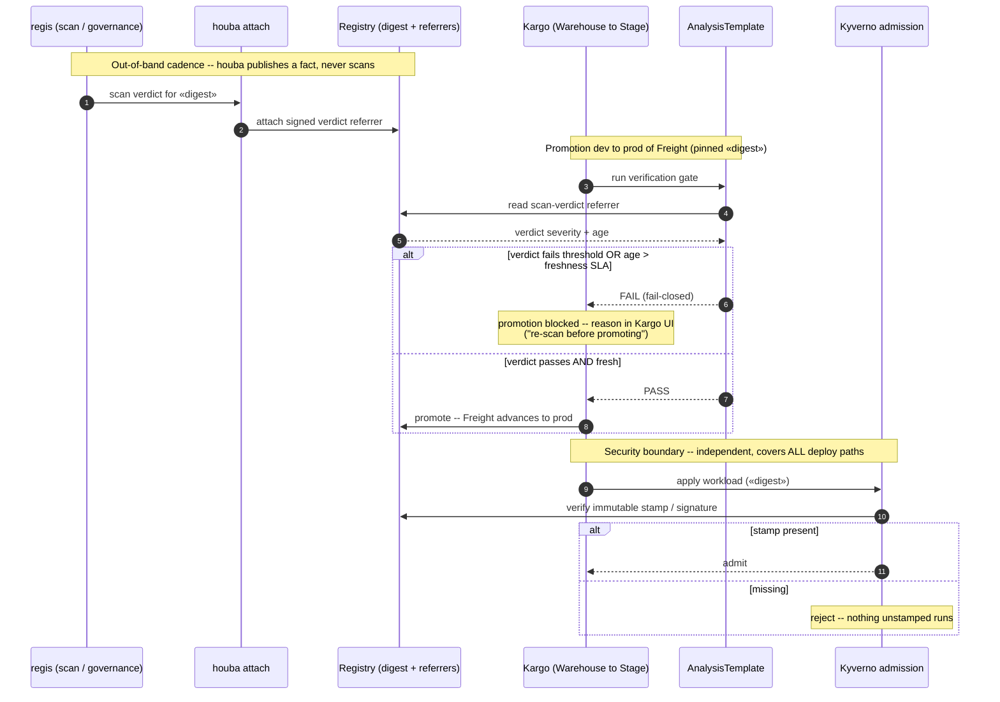
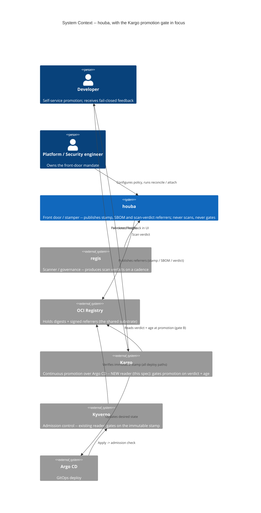

# Kargo promotion gate — design (houba as a third reader)

> **Status:** pre-implementation design, exploration. The riskiest assumption (§6) is **untested** —
> the terminal step after validating it is either `writing-plans` (if `houba verify` earns its
> place, §5) or "close as docs/demo only" (if it does not). No houba-core code is implied yet.
> Builds on the provenance stamp (`houba/domain/stamp.py`), the OCI **referrers** model, and the
> scan-result ingestion verb (`houba attach`, see [2026-06-12-attach-scan-result-design.md](2026-06-12-attach-scan-result-design.md)).

## 1. Context & motivation

[Kargo](https://kargo.io/) is a **continuous-promotion** orchestration layer over Argo CD. A
*Warehouse* subscribes to artifacts (images / git / Helm charts) and produces **Freight** — a pinned
set of digests — which it promotes **Stage → Stage** (dev → stage → prod) through promotion
pipelines, with verification gates (Argo Rollouts `AnalysisTemplate` / `AnalysisRun`) between stages.

Kargo and houba sit on **different layers and stack** — they do not compete. Kargo *moves* digests
between environments; houba decides *which* digests may exist and carries their provenance / SBOM /
scan facts. A validated platform/security team already runs multi-env promotion, so the integration
surface has a real client (not feature-parity exploration).

## 2. The framing that keeps the boundary intact

houba **does not integrate with Kargo**. houba adds a **third reader** to the same signed-referrer
substrate it already publishes to:

1. **Kyverno** reads the stamp / signature → **admission** gate
2. **regis / SARIF** verdict published as a referrer → **governance** ([[scanstep-design]] pivot)
3. **Kargo** reads the same fact → **promotion** gate

This is the proven *"houba publishes, the enforcer reads"* pattern, instantiated a third time. The
gate is a Kargo `AnalysisTemplate` that **reads** a referrer; houba never executes inside Kargo's
loop. A "houba promotion step" (a verb in the pipeline) is **explicitly rejected** — that is the
scanstep overreach returning ([[scanstep-design]]).

## 3. Not a doublon with Kyverno — only if the facts are split by nature

The recurring objection is "the admission gate already checks this." It is a true doublon **only if
both gates check the same fact**. Split by the fact's nature and they are complementary:

| Fact | Nature | Right gate | Why |
|------|--------|-----------|-----|
| **Stamp / signature** | immutable, binary — "came through the front door" | **Kyverno admission** | cheap, deterministic, re-checked at every apply; covers **all** deploy paths |
| **Scan verdict** | **mutable, ages**, severity-thresholded | **Kargo promotion** | a deliberate flow decision; pushing it into admission = fetch+evaluate a signed referrer on every pod admission, expensive **and** already stale |

Load-bearing consequence: **Kyverno is the security boundary; Kargo is the workflow boundary.** Kargo
governs only what flows through promotion — a direct `kubectl apply` / out-of-pipeline Helm install
bypasses it entirely. **Kargo cannot replace Kyverno** and is not a security control. Dropping
Kyverno "because Kargo covers it" would be a security regression.

## 4. The decisive pain is feedback *timing* — which has two halves

The team's pain is the **moment of feedback** (shift-left), not enforcement coverage. That makes the
promotion gate worth building on top of Kyverno — but "timing" is two problems, not one:

- **B — feedback at the flow event (promotion).** The Kargo gate fires **only on a promotion
  event**: "do not *advance* a digest whose verdict is already failing."
- **C — feedback when the world changes under stable Freight.** The worst case — image promoted clean,
  CVE drops later on something *already in prod* — triggers **no promotion**, so B says nothing. This
  case lives in the **blast-radius query** (`houba audit` + the demo's digest join, gaining a Kargo
  Stage/env leg).

**B and C are the two halves of feedback timing, not lead vs follow-on.** "Feedback solved" requires
both; the worst case is in C.

### 4.1 Freshness without re-scan (a trap inside B)

The verdict the gate reads is only as fresh as the last `houba attach`. Shift-left a stale verdict =
false confidence. Therefore the gate must check **verdict age, not just severity** → fail-closed on
stale ("re-scan before promoting"). houba must **not** re-scan at promotion time — that is scanstep
redux. Freshness comes from an **external scan cadence (regis)** plus a **referrer-age check** in the
`AnalysisTemplate`. houba reads; it never scans.

### 4.2 Sequence — the two gates on one digest

The promotion gate (B, fail-closed on stale verdict) and the admission boundary (Kyverno, on the
immutable stamp) are independent and read the **same** referrer substrate houba publishes out-of-band.
houba never appears as an executing step — it only publishes the fact others read.



## 5. Open product question — does `houba verify` earn its place? (YAGNI gate)

The gate needs to read "current scan verdict + its age for this digest." Today the CLI is
`reconcile · purge · attach · audit · version` — there is **no `verify`**. `attach --fail-on` is
write+gate at *ingestion* (wrong moment for a promotion); `audit` is fleet-wide coverage, not a
single-digest pass/fail.

Candidate primitive: **`houba verify <digest> --require stamp,scan-pass,sbom`** → exit 0/1,
read-only, exposes **verdict + age**, never scans or rebuilds (does not cross the scanstep line). It
is the read-side symmetric counterpart of `attach`.

- **For:** clean gate primitive; encapsulates houba's annotation / referrer conventions so each gate
  (Kargo, Kyverno sidecar, CI) does not re-assemble them — the same argument that justifies `attach`.
- **Against (rung 1 of the ladder):** `cosign verify-attestation` + `regctl referrers` already do the
  raw work; the only added value is convention encapsulation.

**Decide after the §6 maquette, not before.** If `verify` is built it is a new CLI verb + a read-only
use case → triggers the C4 / ADR / example sync (§8).

## 6. Riskiest assumption & cheapest test

**Riskiest:** Kargo's verification mechanism can read an OCI-referenced fact (verdict + age) with
**no change to houba**.

**Cheapest test:** one `AnalysisTemplate` on a single Stage transition that reads **verdict + age** of
a digest and fail-closes on stale. Red/green cleanly → validates B *and* exhibits the need for C, with
**zero houba-core code**. Only then revisit §5.

### 6.1 Maquette — the `AnalysisTemplate`

Argo Rollouts `AnalysisTemplate` (what Kargo runs as a verification gate), `job` provider. The job
**only reads** referrers — never scans, never rebuilds — and **fail-closes** on anything missing,
unsigned, too severe, or stale. Tooling image bundles `regctl` + `cosign` + `jq` (not the houba
runtime image, which carries none of jq/curl by design). Annotation keys/artifactType below follow
houba's `attach` convention and are **illustrative** — pin them to the published ingestion profile.

```yaml
apiVersion: argoproj.io/v1alpha1
kind: AnalysisTemplate
metadata:
  name: houba-scan-gate
spec:
  args:
    - name: image                      # full ref incl. @sha256:… — injected by Kargo from Freight
    - name: max-severity
      value: high                      # critical > high > medium > low > unknown
    - name: max-age-days
      value: "7"                       # freshness SLA — verdict older than this fails closed
  metrics:
    - name: verdict-passing-and-fresh
      count: 1                         # one shot — the gate is a single pass/fail
      failureLimit: 0                  # any failure ⇒ analysis fails ⇒ promotion blocked
      provider:
        job:
          spec:
            backoffLimit: 0
            template:
              spec:
                restartPolicy: Never
                containers:
                  - name: verify
                    image: ghcr.io/example/oci-verify-tools:latest   # regctl + cosign + jq; reads only
                    env:
                      - { name: IMAGE,        value: "{{args.image}}" }
                      - { name: MAX_SEVERITY, value: "{{args.max-severity}}" }
                      - { name: MAX_AGE_DAYS, value: "{{args.max-age-days}}" }
                      - { name: VERDICT_TYPE, value: "application/vnd.houba.scan-verdict+json" }
                    command: ["sh", "-eu", "-c"]
                    args:
                      - |
                        # 1. Locate the signed scan-verdict referrer (houba attach convention).
                        ref=$(regctl referrers "$IMAGE" --filter-artifact-type "$VERDICT_TYPE" \
                              --format '{{ with index .Descriptors 0 }}{{ .Digest }}{{ end }}')
                        [ -n "$ref" ] || { echo "FAIL: no scan verdict attached → fail-closed"; exit 1; }
                        subj="${IMAGE%@*}@${ref}"

                        # 2. Verify the referrer signature — unsigned/tampered → fail-closed.
                        cosign verify "$subj" \
                          --certificate-identity-regexp "$SIGNER_ID" \
                          --certificate-oidc-issuer "$OIDC_ISSUER" >/dev/null \
                          || { echo "FAIL: verdict signature invalid → fail-closed"; exit 1; }

                        # 3. Read severity bucket + emission time from the verdict annotations.
                        ann=$(regctl manifest get "$subj" --format '{{ json .Annotations }}')
                        sev=$(echo "$ann"     | jq -r '."io.houba.scan.max-severity" // "unknown"')
                        created=$(echo "$ann" | jq -r '."org.opencontainers.image.created" // empty')

                        # 4. Severity gate.
                        rank() { case "$1" in critical) echo 4;; high) echo 3;; medium) echo 2;;
                                              low) echo 1;; *) echo 0;; esac; }
                        [ "$(rank "$sev")" -le "$(rank "$MAX_SEVERITY")" ] \
                          || { echo "FAIL: severity $sev > allowed $MAX_SEVERITY"; exit 1; }

                        # 5. Freshness gate — missing or stale timestamp → fail-closed.
                        [ -n "$created" ] || { echo "FAIL: verdict has no timestamp → fail-closed"; exit 1; }
                        age=$(( ( $(date -u +%s) - $(date -u -d "$created" +%s) ) / 86400 ))
                        [ "$age" -le "$MAX_AGE_DAYS" ] \
                          || { echo "FAIL: verdict ${age}d old > ${MAX_AGE_DAYS}d SLA → re-scan"; exit 1; }

                        echo "PASS: severity=$sev age=${age}d"
```

**Wiring (Stage excerpt — illustrative):** Kargo runs the gate on the promotion candidate and injects
the Freight digest as the `image` arg.

```yaml
spec:
  verification:
    analysisTemplates:
      - name: houba-scan-gate
    args:
      - name: image
        value: ${{ imageFrom("registry.example/app").RepoDigest }}   # pinned Freight digest
```

**The §5 fork, made concrete.** If `houba verify` lands, steps 1–5 collapse to one line — the whole
point of the primitive being that it encapsulates houba's referrer/annotation conventions:

```sh
houba verify "$IMAGE" --require scan-pass --max-severity "$MAX_SEVERITY" --max-age "${MAX_AGE_DAYS}d"
```

The maquette deliberately ships the raw-tools version first (zero houba code) so the §6 test can run
before that build/no-build decision is taken.

## 7. Scope

**In scope (once validated):** an `AnalysisTemplate` recipe + how-to (the Kargo promotion gate),
folded into the existing Argo demo; the Warehouse subscribing to the **stamped** registry, not
upstream (free positioning — "A"); a Kargo Stage/env leg on the blast-radius demo (C).

**Out of scope:** a houba promotion *step* (scanstep redux); houba re-scanning at promotion;
replacing Kyverno with Kargo. `houba verify` is **conditional** on §5/§6.

## 8. C4 / ADR / examples sync obligation

Per `CLAUDE.md`, a committed spec that shifts architecture must update `workspace.dsl` (+ ADR +
examples) **in the same change**. This spec adds **Kargo as a new external reader** at context level
(sibling to Kyverno) and, conditionally, the `houba verify` verb.

**Recommendation:** defer the C4 / ADR / example edits until the §6 maquette validates feasibility —
the spec deliberately makes all houba-side implementation conditional and the integration is
untested, so modelling it now would be speculative. The obligation **fires when implementation is
green-lit** (the maquette passes and/or `verify` is approved). This deferral is itself recorded here
so the model is not silently left to drift.

### 8.1 Intended context delta (illustrative — canonical `workspace.dsl` update deferred)

The diagram below is what the deferred `workspace.dsl` change would encode at **context** level: it
documents the delta now (so the deferral is concrete), and is **not** the source of truth — the
canonical C4 update lands when implementation is green-lit. The only structural addition is **Kargo
as a new external reader of the referrer substrate**, sibling to the existing Kyverno reader; houba's
role is unchanged (it publishes, it does not execute in any reader's loop).


