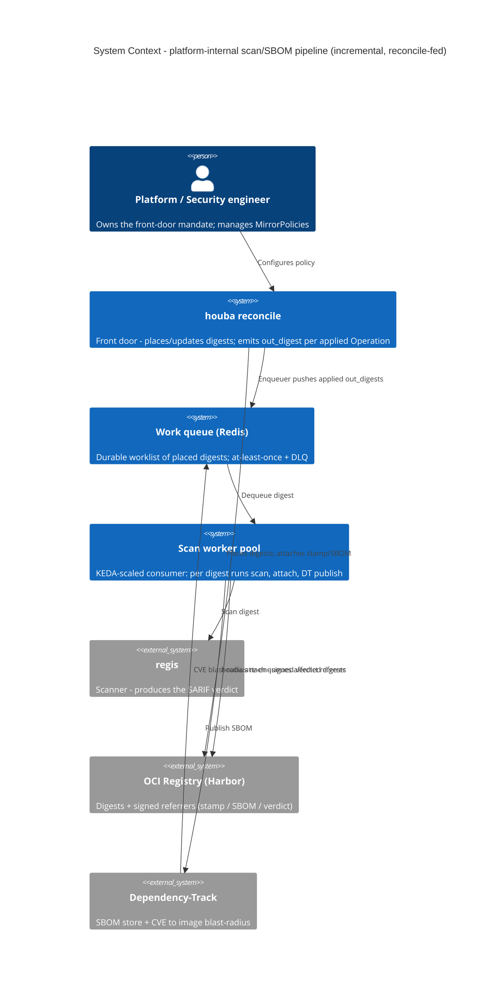
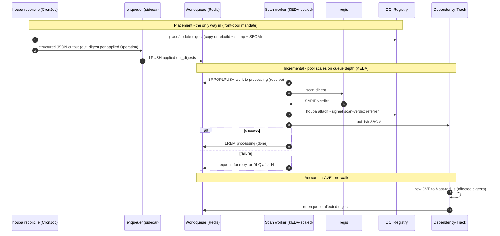

# Platform-internal scan + SBOM pipeline — incremental, reconcile-fed (not a walk, not Kargo, not a bus)

> **Status:** Design (approved) — pre-implementation. Reworked 2026-06-25 in a brainstorming pass
> after a live `regctl` benchmark refuted the original walk-based backbone. **The backbone requires no
> houba-core change** (§4): it is deployment glue over reconcile's existing structured output
> (`Operation.out_digest`, [report.py](../../../houba/use_cases/report.py)) and the existing
> `houba attach`. Builds on the producer-side freshness decision in
> [2026-06-16-scan-max-age-design.md](2026-06-16-scan-max-age-design.md) and the reconcile output
> contract in [2026-06-11-reconcile-output-design.md](2026-06-11-reconcile-output-design.md).

## 1. Context & motivation

The platform/security team owns the supply chain of a large group: **>300 clusters, a Harbor with
~150k images.** houba is the front door (rebuild/harden, stamp, SBOM); `regis` governs (scan → SARIF
verdict). The missing piece is the **operational loop that runs the post-placement work** over each
image houba places: **`regis scan` → `houba attach` the signed verdict → publish the SBOM to
Dependency-Track.**

Two scoping facts fix the whole design:

- **Scope A — houba-placed images only.** The pipeline ensures *"every image houba placed is scanned /
  attached / in DT."* It does **not** hunt for images that bypassed the front door (a direct push to
  Harbor) — that is the separate `audit ④` question (B), §7. houba is the source of truth for A; the
  registry is not.
- **Target — all images.** houba's goal is to be the front door for **every** image. Today it manages
  ~0; the target is ~150k. The set grows **one placement at a time** along the adoption ramp.

## 2. The two facts that killed the walk and chose the shape

**Fact 1 — the per-image cost is the ceiling, not enumeration.** A live benchmark (the `regctl`
per-image probes `houba audit` runs — `image digest` + `manifest get`) measured **~1 s/image** against
the real registry. The cause is structural: the adapter **spawns a fresh `regctl` process per call**,
so every image pays a **cold TLS handshake + auth** (no keep-alive, no connection reuse — a property
of houba's deliberate "no HTTP layer"). Extrapolated to 150k: **~46 h base, ~115 h with
`--signed --sbom`.** The sample was small and fixed-cost-dominated (re-run with ~200 images for a true
steady-state rate, likely 2–5× faster), but even 5× faster the conclusion is robust: **a periodic
full-fleet walk is hours-to-days and cannot be the backbone.** `_catalog` was a red herring — the
scoped walk pays the same per-image cost.

**Fact 2 — "all images via the front door" makes incremental complete.** If every image passes through
`reconcile`, then scanning each image **at placement** covers the fleet **by construction** — nothing
escapes, because nothing enters except through reconcile. The 150k is never walked as a batch; it
accumulates one placement at a time, and the per-image cost is paid **spread over the adoption ramp +
ongoing churn**, tied to actual placement work, never in a sweep.

The two facts agree: **the backbone is incremental-at-placement, not a periodic walk** — and
enumeration (`_catalog`, Harbor API, policy-scoped listing) is **not needed in the backbone at all.**

## 3. The design — incremental, reconcile-fed

```
houba reconcile (CronJob, exists)            scan worker pool (glue)
  places/updates digests                       dequeue digest
  emits structured JSON with                     → regis scan
  out_digest per applied Operation               → houba attach (signed verdict)
        │                                         → publish SBOM to Dependency-Track
        ▼                                         → ack  (fail → retry → DLQ after N)
  enqueuer (glue): parse output,             ▲
  enqueue applied out_digests   ──────────►  │  durable work queue (Redis/NATS/SQS/…)
                                                at-least-once + dead-letter
```

- **Producer — `houba reconcile`** (the CronJob that already exists). Its output is a **structured JSON
  contract** (schema-published) whose every `Operation` carries `out_digest` (the produced digest, set
  iff `applied`). **The scan worklist is exactly the `out_digest`s of applied operations.** houba
  emits a list; it never imports a queue or any eventing — it stays **eventing-agnostic.**
- **Handoff — a durable work queue** (technology is deployment glue: Redis list / NATS / SQS / a DB
  table). A thin **enqueuer** (glue) parses reconcile's output and pushes the applied `out_digest`s.
  At-least-once + dead-letter.
- **Consumer — a scan worker pool** (glue). Dequeue a digest → `regis scan` → `houba attach` → publish
  SBOM to DT → ack; on failure, retry, then DLQ after N. **Pool parallelism is the throughput knob**
  (gated by regis capacity, not by houba), a K8s setting.
- **Rescan on CVE.** Dependency-Track already does CVE→image blast-radius; a thin job **re-enqueues**
  the affected digests into the **same** queue → same worker path. Not a walk.
- **No periodic full walk. No `_catalog`. No enumeration. No Argo Events/Workflows. No Kargo.**

### 3.1 System context

houba (reconcile + the enqueuer glue) is the producer; the registry, regis and Dependency-Track are
the external systems the worker pool reads/writes. No new context-level actor is introduced.



### 3.2 Sequence

Placement is the only way in (the mandate); the worklist is reconcile's own `out_digest`s; the worker
processes each digest with a reliable-queue reservation (`BRPOPLPUSH` → remove-on-success /
requeue-or-DLQ-on-failure); CVE rescans re-enter the same queue. No walk anywhere.



## 4. houba-core footprint — essentially none

The backbone is **pure deployment composition of existing houba verbs.** reconcile **already** emits
`out_digest` per applied `Operation` in a schema'd JSON contract; the worker **already** has
`houba attach` (and `regis` + a thin DT push). The enqueuer, the queue, the worker pool, the DLQ are
**deployment glue outside the hexagon.** No new port, adapter, or use case is required for the
backbone.

Two optional, deferrable extras (NOT on the critical path):

- The **`houba audit --scan` presence tier** (twin of `--signed`/`--sbom`, ADR 0036) — useful **only**
  for the optional insurance walk (§6) and the coverage portal, never for the backbone. Defer until a
  walk is actually wanted.
- If the per-image throughput ceiling (Fact 1) ever has to be lifted for a fleet-scale walk (question
  B, §7), that is a **registry-client architecture change** (persistent/pipelined client vs
  subprocess-per-call, against the current "no HTTP layer") — explicitly **out of scope** here and
  unneeded by this incremental backbone.

## 5. Why not the alternatives

| Alternative | Verdict |
|---|---|
| **Periodic full / scoped walk** (the original §3) | **Killed by Fact 1** — hours-to-days per sweep at 150k; the scoped walk pays the same per-image cost. |
| **Enumerate via `_catalog` or the Harbor API** | **Not needed** — the backbone never re-discovers what houba placed; reconcile just placed it. Enumeration only matters for question B (§7). |
| **Argo Events / Argo Workflows** | **Single client** (confirmed) → a bus/engine for one point-to-point pipe is net-new infra for nothing. A work queue is right-sized. Adopt a bus only when multiple sources/consumers justify it. |
| **Kargo** | A promotion engine, not a per-artifact post-processor. Reserved for the **project-team promotion gate** ([2026-06-23-kargo-promotion-gate-design.md](2026-06-23-kargo-promotion-gate-design.md) §9), deliberately deferred. |
| **reconcile does scan inline** | Rejected — couples reconcile to the scanner, breaks **houba ≠ scanner**, and overloads the heavy placement path. reconcile emits; the worker scans. |

## 6. Self-healing & idempotency

The worker is **idempotent** — re-scanning a digest is harmless (`attach` accumulates+gc's, DT
replaces per project) — so **at-least-once delivery is sufficient** and duplicates cost nothing.
Durability seam: the enqueuer drains reconcile's **persisted** output artifact idempotently (dedup by
digest), so a crash re-reads rather than drops. The queue's retry + DLQ **is** the bounded
self-healing mechanism (failure-only state, never 150k).

**Optional deep insurance** against a fully-dropped digest: a **slow, rare, policy-scoped** coverage
walk (the demoted ex-backbone) run occasionally — explicitly "eventually," never the heartbeat, and
gated on the `--scan` tier (§4). YAGNI until a dropped digest is actually observed.

## 7. Scope

**In scope:** the enqueuer, the work queue, the scan worker pool, the DT push, the CVE-driven
re-enqueue job — all deployment glue; reuse of reconcile's `out_digest` output and `houba attach`.

**Out of scope:** question **B** (images that bypassed the front door) — it needs enumeration (Harbor
API or an affordable catalog sample) and is a separate, low-frequency audit; the mandate (front door +
Kyverno admission) is what makes A complete, B is belt-and-suspenders for the gap between "pushed to
Harbor" and "admitted to a cluster." Also out: a periodic full walk; Argo Events/Workflows; Kargo;
lifting the per-image throughput ceiling; any end-consumer/project-team surface.

## 8. C4 / ADR / examples sync

Mirrored as **ADR 0042** (reworked alongside this spec). **Examples** obligation does not fire: no
`MirrorPolicy`/user-facing policy change — the deliverables are deployment manifests and two thin glue
containers (enqueuer, worker), zero houba-core.

**workspace.dsl deferred to implementation, deferral recorded** (Kargo-spec precedent). The structural
delta is **deployment** level only — Dependency-Track, regis, and the `houba-reconcile` CronJob are
already modelled; the additions are the work queue, the enqueuer, and the scan worker pool, all
consuming reconcile's existing output. No context-level actor or external system is added. The C4 edit
fires when implementation is green-lit.
