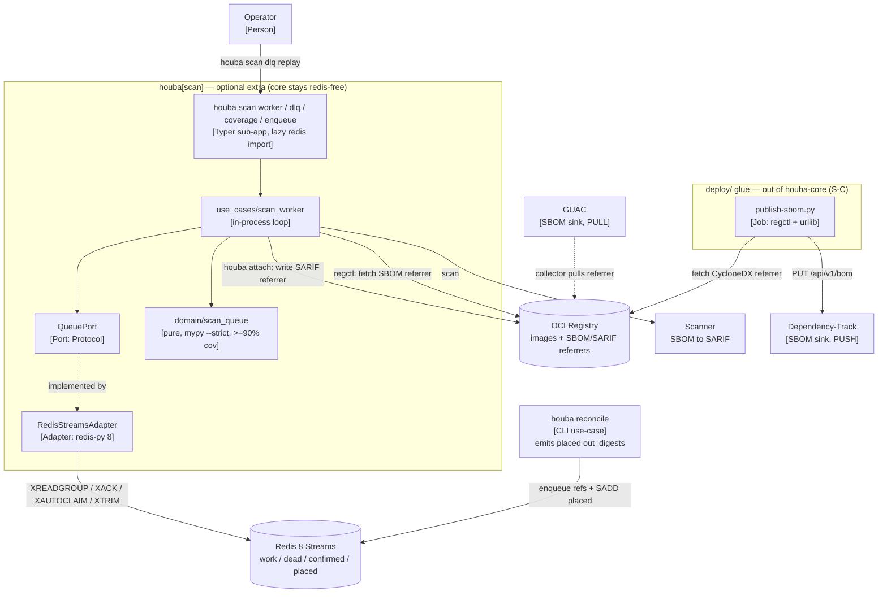
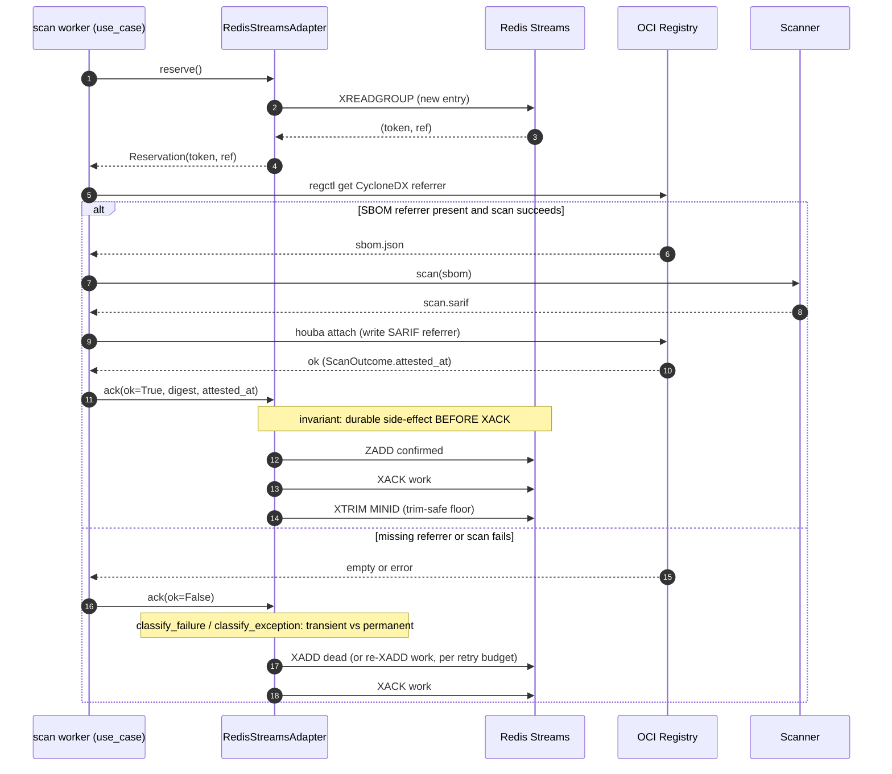

# Spec: `houba scan` command group (optional extra) + SBOM-publish stays a referrer-bridge

Status: **Draft**
Date: 2026-06-26
Relates to: #187 (platform scan pipeline), #188 (Redis Streams rebuild), #189 (redis:8 image bump)
ADR: [0043](../../architecture/decisions/0043-houba-scan-command-group-optional-extra.md)

## Summary

Promote the platform scan pipeline (shipped by #188 as `deploy/` + `scripts/` glue) into houba's
hexagonal layers as an **optional extra** (`pip install houba[scan]`), while keeping core houba
`redis`-free. The SBOM-publish-to-Dependency-Track path stays a deployment-glue script bridge — the
OCI referrer remains houba's SBOM interface, no `SbomSinkPort` is built. Two independent cuts:
**D** (scan → optional extra) and **S-C** (SBOM publish → referrer bridge).

The work is mostly relocation, not new architecture: #188 already split the pipeline into pure
decision logic (`scripts/scan_queue.py`, unit-tested) and a thin redis-py I/O boundary
(`scripts/scan_streams.py`, integration-tested). D finishes that hexagon by moving the pure module
into `houba/domain/`, fronting the I/O with a `QueuePort` + `RedisStreamsAdapter`, and exposing a
`houba scan` Typer sub-app.

## Problem & context

#188 rebuilt the scan pipeline on Redis Streams under a deliberate "zero houba-core" boundary
(redis confined to the image; reconcile already emits the worklist). The question: should those
scripts — plus SBOM-publish-to-DT/GUAC — become a first-class `houba` command group? Drivers:
operator UX, testability, distribution, tidiness.

The scripts are **two populations** with different centers of gravity:
- **Substrate-coupled worker mechanics** (`scan-reserve/-ack/-reaper/-enqueue`, `scan-one.sh`):
  `/shared/digest`, the Streams I/O, pod lifecycle, KEDA. Run by the ScaledJob, never typed by a
  human.
- **Human-invoked operator surface** (`scan-dlq` triage, `scan-coverage`): run mid-incident.

And SBOM-publish is a separate axis that touches houba's *product thesis*, not its substrate.

What #188 already built (the enabling fact — D is ~80% relocation):
- `scripts/scan_queue.py` — **pure** decision logic, no `import redis`, unit-tested
  (`tests/unit/scripts/test_scan_queue.py`): `enqueue_refs`, `should_dead_letter`,
  `classify_failure`/`Failure`, `coverage_gap`, `gap_by_owner`.
- `scripts/scan_streams.py` — thin redis-py I/O boundary, integration-tested
  (`tests/integration/test_scan_streams.py`): `reserve`/`ack`/`dead_letter`/`reaper`/
  `coverage_check`/`dlq_list`/`dlq_replay`/`dlq_drop`/`_trim_minid`, with the documented invariant
  **XACK is always the last op** (every durable side-effect completes first).
- `scripts/scan-dlq.py` — operator surface; argv shims wrap the two modules.

## Decision: D + S-C

- **Scan pipeline → Approach D.** A `houba scan` command group behind a `QueuePort` +
  `RedisStreamsAdapter`, shipped as an **optional extra**, redis-py opt-in. Core houba stays
  redis-free. The pure logic comes under the `≥90%` domain gate + `mypy --strict`.
- **SBOM publish → Approach S-C.** The OCI referrer is houba's SBOM interface. The DT push stays a
  script bridge (`publish-sbom`); GUAC pulls (zero new houba code); `dt-bootstrap` stays glue. No
  `SbomSinkPort` unless "houba delivers to sinks" becomes a permanent product promise.

## Premises

1. The scripts are two populations (above); only the operator surface is human-typed.
2. CLI-ifying the worker into **core** would weld redis-py into houba-core and force it on every
   user — a net negative for distribution. The optional-extra pattern avoids that.
3. The decision logic carries real, caught bugs (#188's three silent failures: trim evicting un-read
   same-ms entries, false-green coverage, KEDA cold-start deadlock; plus the `dead_letter`-does-not-
   trim footgun) that belong under houba's test gate.
4. The OCI referrer **is** houba's SBOM interface. `publish-sbom` exists only to compensate for DT's
   lack of referrer-pull; it is bridge-ware.
5. DT and GUAC are asymmetric: DT needs a push (BOM_UPLOAD), GUAC pulls. Do not build a push client
   for a puller.
6. `dt-bootstrap` is vendor + k8s lifecycle glue. Never houba-core.

## Approaches considered

**Scan pipeline.** A) full integration into core (redis-py in CLI deps) — rejected, imposes redis on
all users, reverses zero-houba-core with no guard-rail. C) consolidate in `scripts/`, zero CLI —
preserves the boundary but no `houba scan` ergonomics and the pure logic never reaches the domain
gate. **D** (chosen) — optional extra, delivers all four drivers, core stays redis-free.

An independent review challenged D as over-built ("C-plus": domain-gate `scan_queue.py` + thin
operator CLI, leave the worker a script). **D was kept** — the worker-as-tested-use-case is wanted
and the door sequencing (below) de-risks it — with the review's verified findings folded in.

**SBOM publish.** S-A) DT/GUAC client in core — rejected (vendor-API churn in core). **S-C** (chosen)
— referrer is the interface. S-D) pluggable `SbomSinkPort` — deferred behind an explicit product
decision.

## Architecture

**C4 Container view (after D + S-C).** The `houba[scan]` extra is the new boundary; core houba stays
redis-free; the SBOM bridge + DT/GUAC sinks stay glue outside it.



**Sequence — the scan worker loop.** The invariant the design protects: every durable side-effect
lands *before* `XACK`, so a crash re-delivers rather than loses.



(Keep these in step with `docs/architecture/workspace.dsl` — Container/Component views are the
source of truth once D lands.)

### Implementation sketch (grounded in #188's modules on `main`)

- **Domain (relocation):** `scripts/scan_queue.py` → `houba/domain/scan_queue.py`, essentially
  as-is; bring under `mypy --strict` and the `≥90%` gate; move its unit tests to `tests/unit/domain/`.
- **Port:** `houba/ports/queue.py` — `QueuePort` (Protocol) mirroring the verbs `scan_streams.py`
  exposes (`reserve`/`ack`/`dead_letter`/`reaper`/`coverage_check`/`enqueue`/`dlq_*`) + a frozen
  `Reservation(token, ref)`. **Redis-leak test:** no method name or signature may say
  `XADD`/`XACK`/`XAUTOCLAIM`/`stream`/`msg_id` — the stream id is wrapped in `Reservation.token`
  (opaque, documented as adapter-private). If one leaks, the port is mis-cut (degenerated to A).
- **Adapter:** `houba/adapters/redis_streams.py` — `RedisStreamsAdapter` implementing `QueuePort`,
  lifted from `scan_streams.py`; hold the `redis.Redis` connection as instance state; map
  `redis.exceptions.*` to `QueueError` (and `QueueUnavailableError` on connection loss). Preserve the
  invariants verbatim (ack order `ZADD confirmed → XACK → trim`; dead-letter `XADD dead → XACK`; the
  `_trim_minid` floor). Repoint `tests/integration/test_scan_streams.py` at the adapter (real
  `redis:8`); assert response shapes (redis-py 8 defaults to RESP3).
- **Use case:** `houba/use_cases/scan_worker.py` — the reserve→fetch-SBOM→scan→attach→ack loop. The
  worker **drives the scanner subprocess in-process** (captures `(stage, exit_code, stderr)` for
  `classify_failure`) and **calls the attach use case (`attach_scan`) in-process** (not a `houba
  attach` subprocess). Takes `QueuePort` as a parameter (wired in `_di.py`); reuse the registry
  session across messages (no per-message re-login inside the critical section). Cross-pod scaling +
  the reaper/coverage *schedules* stay in `deploy/` (KEDA ScaledJob + CronJobs invoking `houba scan
  reaper` / `houba scan coverage`).
- **CLI + lazy registration:** `houba/cli/scan.py` builds a Typer sub-app registered via
  `app.add_typer(scan_app, name="scan")` in `main.py` (new pattern — the app is flat today). redis-py
  must NOT import at module load; each callback imports it on first invocation and translates
  `ModuleNotFoundError` into a clean `pip install houba[scan]` message. Subcommands: `worker`
  (`--check` preflight), `enqueue`, `reaper`, `coverage` (`--fail-on-gap[=PCT]`), `dlq
  {list|show|replay|drop}`.
- **Config:** route the flat `REDIS_*` env into `config.py` as a single `HOUBA_SCAN_REDIS` JSON var
  (roster pattern). **Loud migration:** if a stale flat `REDIS_*` var is still set after the switch,
  error (`REDIS_ADDR set but ignored; use HOUBA_SCAN_REDIS`) rather than silently using defaults.
- **Errors:** `QueueError(AdapterError)` (→ exit 2) + `QueueUnavailableError` (distinct exit code for
  connection-loss, so a pod-restart alert tells a benign Redis flap from a cosign-broken storm — an
  intentional, documented carve-out from "exit code derives from base class").
- **Dependency:** `[project.optional-dependencies] scan = ["redis>=8"]`. The existing `redis>=5.0`
  test/CI pin moves to the **same `>=8` floor** so tests run on the shipped major. Core deps
  unchanged.
- **Image + cutover:** install `.[scan]`; entrypoints become `houba scan worker/reaper/coverage/
  enqueue`. Same Redis keys ⇒ in-flight entries survive the swap (no drain). Keep the argv shims one
  release as fallback, then delete (`scan-reserve/-ack/-reaper/-coverage/-enqueue.py`, `scan-dlq.py`,
  `scan-one.sh`, and the now-internal `scan_queue.py`/`scan_streams.py`). **`scan-attach.sh` is
  retained** as the bulk-backfill path (the enqueuer is reconcile-fed, so pre-existing digests have
  no other scan path).
- **Enqueue contract:** `houba reconcile --report-json | houba scan enqueue` (a new `--report-json`
  data-output flag on core reconcile — a small, redis-free core change; a reconcile `--enqueue` mode
  is rejected, it would leak redis into core).
- **Observability:** worker/dlq/coverage emit per-event structured logs through the `Reporter` port
  (scan-duration; a dead-letter event; the coverage gap). Cross-pod aggregation (dead-letter rate,
  gap size) is a metrics-sink (Prometheus/OTel) concern, out of scope for Door 1 — the events are the
  contract.

### S-C — concrete steps

- **Rewrite `publish-sbom.sh` → `scripts/publish-sbom.py`** (stays glue, not a houba command): stdlib
  + `regctl` via subprocess (fetch the CycloneDX referrer) + `urllib` for the DT `PUT /api/v1/bom`;
  same env and tolerances; one pure helper (roster resolution) with an `assert` self-check. Update
  `deploy/base/job-publish-sbom.yaml`, the kustomize configMap mount, the `Dockerfile` comment, and
  the docs that name the file; delete the `.sh`.
- Document GUAC: aim the collector at the registry; houba writes the CycloneDX referrer, GUAC
  ingests. No houba code.
- Leave `dt-bootstrap.py` untouched. Build `SbomSinkPort` (S-D) only on an explicit product decision.

## Door sequencing

```
Door 0 (infra, separable):  redis:8 server (done — #189) + redis-py 8 + RESP3 staging AOF pass
Door 1 (two-way, internal): domain reloc + QueuePort + RedisStreamsAdapter + scan_worker
                            (in-process attach + scanner, real attested_at, exception-aware classify)
                            + `houba scan worker/enqueue/reaper/coverage`; enqueue via stdin pipe
Door 2 (one-way, surface):  public `houba scan dlq` operator CLI, once the boundary proves out
```

Door 0 / Door 1 must keep the Redis major-bump (server + CI service + client) on **one locus** so a
Door 1 rollback can't split majors. (#189 already moved the server image to v8.)

## Key design decisions (rationale)

- **`attested_at` is `clock.now()`, threaded via `ScanOutcome` — not a port extension.** Verified:
  `attach_scan` computes `now = clock.now()` (`use_cases/attach.py:72`), embeds it as
  `attested_at=now.isoformat()` (`:93`), then signs (`:96`); `CosignAdapter.attest` scrapes only a
  digest — cosign surfaces no signed timestamp. So the "signed attested_at" is houba's own clock
  reading. `attach_scan` returns it on `ScanOutcome`; the worker threads `outcome.attested_at` into
  `ack()`. (This fixes the latent bug where `scan-one.sh` falls back to `date +%s` because it calls a
  non-existent `houba verify --field attested_at`.) An earlier proposal to extend the attestor port
  was rejected as solving a non-problem.
- **One failure policy, two typed entry points.** `classify_exception(stage, exc) -> Failure` beside
  `classify_failure` in `domain/scan_queue.py`, sharing the verdict strings: the scanner stage keeps
  the stderr path; the in-process attach stage maps `CosignError`→signer-transient, `RegctlError`
  404→permanent. Do not synthesize fake stderr to reuse the matcher.
- **Redis blip = raise, don't reconnect** (the no-retry-logic rule holds); the pod exits, k8s
  restarts, stream redelivery covers the in-flight entry.
- **`replay` skips known-poison by default.** A dead entry carries `kind=permanent` (image gone);
  `replay --all` skips `kind=permanent` (`--include-permanent` overrides), printing `skipped N
  permanent (use drop)`. Destructive `replay --all`/`drop` get `--yes` + `--dry-run`. Matches the
  SQS-redrive / Sidekiq / Temporal bar.
- **Operator CLI polish:** `--json` on all `dlq` verbs; `--limit`+paging on `list`; `--where kind=`/
  `--reason` selectors for bulk ops; non-zero exit when an explicit (non-`--all`) selector matches
  nothing; empty / no-match / redis-unreachable distinguished.

## Test plan

- **CRITICAL regression:** the confirmed-ZSET score equals `ScanOutcome.attested_at` (the attest-time
  `clock.now()` that was signed), not `date +%s`.
- `classify_exception` units: signer-transient, manifest-404-permanent, generic-transient.
- `scan_worker` use-case units (FakeQueuePort/FakeRegistry/FakeAttestor): happy path + each failure
  branch (no SBOM referrer / scan fail / attach fail) → correct queue transition + ack-is-last.
- `attach()` surfaces `attested_at`.
- No-redis CLI test: `houba scan --help` works + prints the install hint with redis-py absent.
- Relocated `scan_queue` units under the domain gate; `scan_streams` integration test repointed at the
  adapter on real `redis:8`, asserting RESP3 response shapes.

## Success criteria

- `houba scan --help` lists `worker/enqueue/reaper/coverage/dlq`; missing redis-py prints the install
  hint, not a stack trace. A test asserts this.
- Core `uv sync` (no extra) does **not** pull redis; `pip install houba[scan]` does.
- `houba/domain/scan_queue.py` under `≥90%` + `mypy --strict`, #188 bug regressions preserved.
- `RedisStreamsAdapter` keeps the integration test green on real `redis:8`; ack/dead-letter ordering
  invariants asserted.
- Runtime image runs `houba scan worker` (+ CronJobs, enqueuer); argv shims + `scan_queue.py`/
  `scan_streams.py` deleted from `scripts/`; `scan-attach.sh` retained as backfill.
- In-flight `houba:scan:work`/`:dead` entries survive the entrypoint swap.
- DT publish unchanged (now `publish-sbom.py`); GUAC documented as pull; `dt-bootstrap` untouched.
- C4 + ADR + reference (+ example) + the `operate-scan-pipeline` runbook (rewritten to `houba scan
  dlq …`) updated in the same change (CI drift gates green).

## Open questions

- **Port generality:** model `QueuePort` around reserve/ack/dead-letter/reap so a second adapter
  (SQS/NATS) is *possible* later — but build exactly one adapter now (YAGNI). Streams specifics stay
  inside `RedisStreamsAdapter`.
- **Extra naming:** `houba[scan]` now; rename to `houba[platform]` only if the SBOM sink (S-D) or
  another platform concern lands.
- **Reaper/coverage scheduling:** the *logic* becomes `houba scan reaper`/`coverage`; the *schedule*
  stays the existing CronJobs (confirm they just swap their command).

## Distribution

The `houba[scan]` optional extra **is** the distribution channel: `pip install houba[scan]`, and the
runtime image bundles it. No separate binary. Existing release pipeline (PyPI + GHCR) covers it; the
`redis` CI service for the integration test runs `redis:8`.
