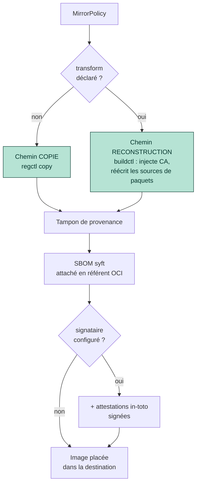
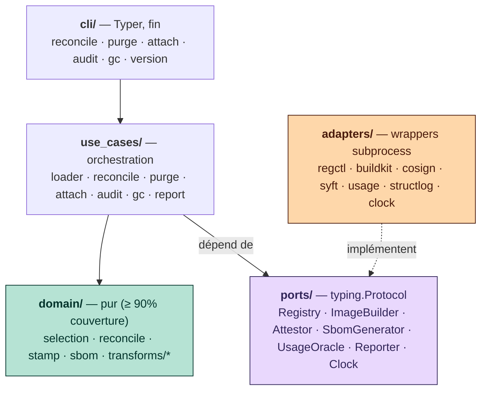

# houba

### La porte d'entrée unique des images conteneur externes

Un **tampon** (*stamper*), pas un miroir : une provenance portable + un SBOM
sur chaque image placée.

<div class="opacity-60 mt-12 text-sm">
Présentation équipe & management · houba 0.8 · 2026
</div>

---
layout: center
---

# 2 h du matin. Un CVE critique tombe.

Une seule question compte dans l'heure qui vient :

> ## Quel est notre rayon d'impact — et qui en est responsable ?

Quelles images qu'on fait tourner sont touchées, où elles tournent,
et **quel pager doit sonner**.

Chaque minute passée à *assembler* la réponse est une minute où la faille est exploitable.

---

## Aujourd'hui, on ne sait pas répondre

On scanne peut-être déjà tout (Trivy en CI, un scanner de registry, un dashboard éditeur).
Ça donne les CVE **d'une image à la fois**. Ça ne dit pas, à l'échelle du parc :

<v-clicks>

- 🚪 **Plusieurs portes d'entrée** — un `docker pull` ici, un miroir là, une image de base
  trois couches plus bas. Aucun endroit unique ne sait ce qui est entré.
- 🧩 **Signal non uniforme** — scanné dans des formats différents, à des moments différents,
  par des outils différents. Rien de portable ni de comparable.
- 👤 **Aucune trace de propriété** sur l'image elle-même → « c'est à qui ça ? » devient
  une fouille archéologique sur Slack.

</v-clicks>

<v-click>

→ La réponse devient un **tableur dans la panique**. À 2 h du matin.

</v-click>

---

## Le problème n'a jamais été *de faire entrer les images*

Le miroir est résolu depuis des années. `skopeo sync` et la réplication Harbor copient
les images **octet pour octet**, et très bien.

Le problème : les images arrivent **sans provenance cohérente, requêtable, portable**.
À l'incident, on a des octets — mais pas de réponses.

<v-click>

<div class="mt-8 p-4 border-l-4 border-blue-500 bg-blue-50 text-blue-900">

**houba n'est pas un miroir de plus.** C'est un **tampon** : une porte d'entrée unique
par laquelle passe chaque image externe, qui est **durcie** là où on le demande
(CA internes, miroirs de paquets internes) et — toujours — **tamponnée** avec la
*même* provenance standardisée + un SBOM.

</div>

</v-click>

---
layout: center
---

# Le pari : une porte, une requête

Parce que **chaque image entrée est passée par houba** et porte le *même* tampon
**plus un SBOM au niveau paquet** (SPDX et/ou CycloneDX, sur chaque image placée —
copie comme reconstruction)…

la question de 2 h du matin se réduit à **une seule requête dans les outils qu'on
exploite déjà** — Datadog, Wiz, Dependency-Track, tout ce qui lit les annotations
OCI et le SPDX/CycloneDX.

> houba **produit** la provenance ; vos outils **répondent** à la question.
> (C'est un tampon, pas un moteur de requête.)

---

## La preuve, c'est le label — et le SBOM

houba écrit deux faits **portables et standards** sur chaque image. Pas de magie,
pas de base de données propriétaire.

````md magic-move
```json
// Le LABEL — annotations OCI standard, lues par n'importe quel scanner
{
  "org.opencontainers.image.source":      "docker.io/library/redis",
  "org.opencontainers.image.base.digest": "sha256:1f3c…",
  "org.opencontainers.image.created":     "2026-06-16T01:53:00Z"
}
```
```json
// + les faits propres à houba, sous un préfixe que VOUS choisissez
{
  "org.opencontainers.image.source":      "docker.io/library/redis",
  "org.opencontainers.image.base.digest": "sha256:1f3c…",
  "io.houba.policy":                      "datastores",
  "io.houba.import":                      "redis",
  "io.houba.variant":                     "hardened",
  "io.houba.owners":                      "group:platform-data,group:sre",
  "io.houba.transform.steps":             "injectCA,rewritePackageSources"
}
```
````

- **Le label** répond à la question image de base **et dit qui appeler** :
  *« toute image dont `base.digest` vaut `sha256:1f3c…`, groupée par `io.houba.owners` ».*
- **Le SBOM** (par syft, sur l'image placée) liste ce qu'il y a *vraiment dedans*,
  jusqu'à la dépendance applicative enfouie dans un fat-JAR :
  *« toute image dont le SBOM contient `log4j-core 2.14.1` ».*

---

## Deux chemins de placement



Pas de `transform` → **copie + tampon**. Un `transform` → **reconstruction** via BuildKit
(injection CA, réécriture des sources de paquets) **+ tampon**.
Les deux reçoivent un SBOM syft ; les deux peuvent être signées.

---

## Sous le capot : architecture hexagonale



`domain/` **pur** (zéro I/O, testé) · `ports/` = les coutures Protocol ·
`adapters/` = wrappers subprocess (pas de couche HTTP, pas de logique de retry) ·
seul `_di` (composition root) importe les adapters.

<div class="text-sm opacity-70 mt-4">
Extraction d'une lib partagée Jenkins/Groovy : la logique métier découplée de l'orchestrateur. C'est <em>la</em> raison d'être du projet.
</div>

---

## La couverture conditionne la valeur

<div class="grid grid-cols-2 gap-8 mt-6">

<div>

Un tampon sur **40 %** du parc = une requête de rayon d'impact **avec des angles morts** —
exactement là où se cache la prochaine faille.

La valeur de houba est proportionnelle au fait d'être la voie **obligatoire** des images externes.

<div class="mt-4 p-3 border-l-4 border-amber-500 bg-amber-50 text-amber-900 text-sm">
L'hypothèse la plus risquée — « une équipe accepterait-elle d'en faire la porte
unique ? » — est désormais <b>validée</b> : confirmée par une équipe plateforme/sécurité.
</div>

</div>

<div>

**L'échelle de couverture (4 niveaux) :**

```
non-couvert  <  tamponné  <  signé  <  avec-SBOM
```

**Leviers d'application :**
- `attach --fail-on <sévérité>` — porte de CI
- `audit --fail-on-uncovered` — porte d'entrée vérifiable
- `audit --signed` / `--fail-on-unsigned`
- `audit --sbom` — dimension de couverture

</div>

</div>

---

## Où en est-on — jeune mais fonctionnel (0.8)

<div class="grid grid-cols-2 gap-6 text-sm">

<div>

**Livré ✅**
- L'hexagone complet : domaine pur + ports + adapters
- Les **deux chemins** : copie *et* reconstruction/durcissement
- Le moteur de transformations enfichable (`injectCA`, `rewritePackageSources`, `setTimezone`)
- Le tampon OCI **+ attestations SLSA/in-toto signées**
- Un **SBOM au niveau paquet** sur chaque image placée (signé sous l'identité houba si configuré)
- Contrat de provenance **gelé**
- Site de doc publié + audit de couverture

</div>

<div>

**Commandes**

```
reconcile   place + tampon + SBOM
purge       suppression cycle de vie
attach      ingère scans → référents signés
audit       couverture de la porte d'entrée
gc          collecte les référents périmés
version
```

**Mandat = applicable & fiable**
`attach --fail-on` · `audit --fail-on-uncovered`
· `audit --signed` · `audit --sbom`

<div class="opacity-70 mt-3">Pas encore durci pour la production.</div>

</div>

</div>

---
layout: center
---

# La suite : rendre le mandat démontrable

La boucle cœur, le mandat applicable/fiable et le rayon d'impact au niveau paquet
sont **livrés**. La frontière n'est plus une fonctionnalité — c'est **l'adoption**.

<div class="grid grid-cols-2 gap-8 mt-6 text-left">

<div>

**Démontrable**
- Récit de **parité de migration** : le fan-out `destinations` *remplace* la réplication
  de registry (et garde SBOM + signature vivants dans chaque copie)
- L'incident **XZ / CVE-2024-3094** rejoué de bout en bout sur le déploiement de référence

</div>

<div>

**Self-service**
- Référence générée plus lisible (rendu de schéma)
- `audit --fail-on-no-sbom` (garde-fou de *backfill*)
- Site de doc déjà en ligne

</div>

</div>

---
layout: center
---

# Essayer

<div class="text-lg">

```bash
houba reconcile <policy>   # place + tampon + SBOM
houba audit --sbom         # mesure la couverture
```

</div>

<div class="mt-8 opacity-80">

📖 Documentation : <https://trivoallan.github.io/houba/>

🏗️ Architecture en profondeur : `docs/architecture/design.md`

🗺️ Thèse produit & cap : `docs/roadmap.md`

</div>

<div class="mt-10 text-xl font-semibold">
Le label <em>est</em> le produit — et il survit à l'outil qui l'a écrit.
</div>
