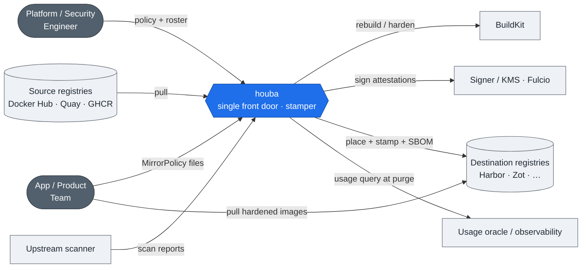
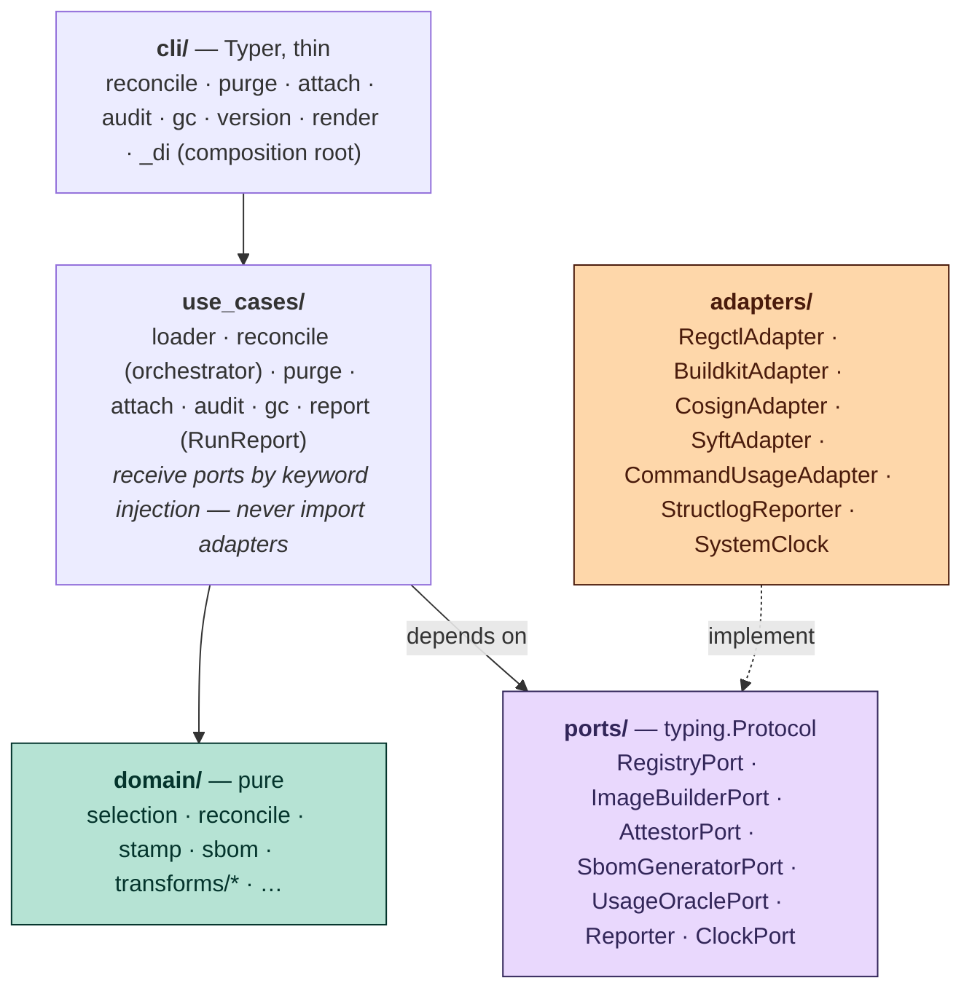
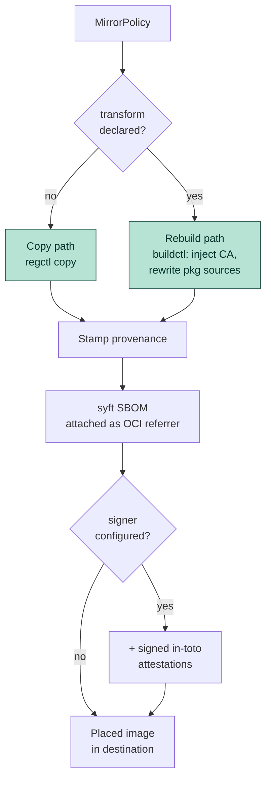
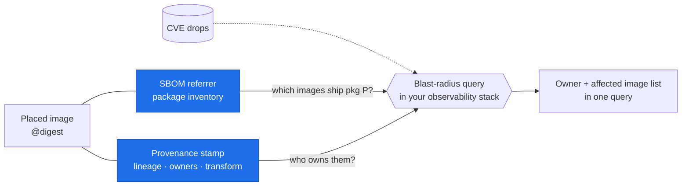

# houba
### The single front door for external images

Stamper, not a mirror — provenance + SBOM on every placed image.

---

## The problem

- External images enter the org through many uncontrolled paths.
- When a CVE drops: *which images ship the vulnerable package, and who owns them?*
- Today that's a fire drill. houba makes it one query.

---

## The landscape

---

## Hexagonal by design

Pure `domain/`; `ports/` are the Protocol seams; `adapters/` are subprocess wrappers; nothing imports `adapters/` except the `_di` composition root.

---

## Two placement paths

No `transform` → copy + stamp. A `transform` → rebuild through BuildKit (inject CA, rewrite package sources) + stamp. Both get a syft SBOM; both can be signed.

---

## The label is the product

The stamp carries lineage + owners; the SBOM carries the package inventory. houba produces the facts; the org's observability stack runs the query.

---

## Coverage gates value

- A stamp on 40% of the fleet = a blast-radius query with blind spots.
- houba's value is proportional to being the *mandatory* front door.
- Enforcement levers: `attach --fail-on`, `audit --signed` / `--fail-on-unsigned`.

---

## Try it

- `houba reconcile <policy>` — place + stamp + SBOM
- Docs: https://trivoallan.github.io/houba/
- Architecture deep-dive: `docs/architecture/design.md`
